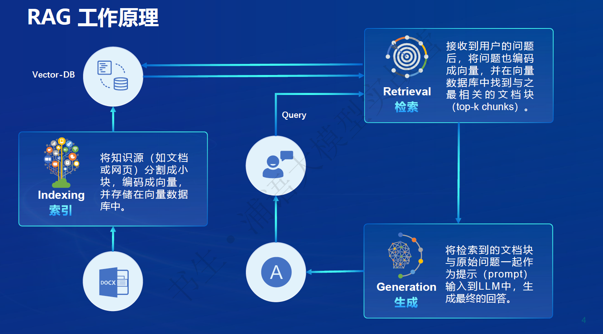
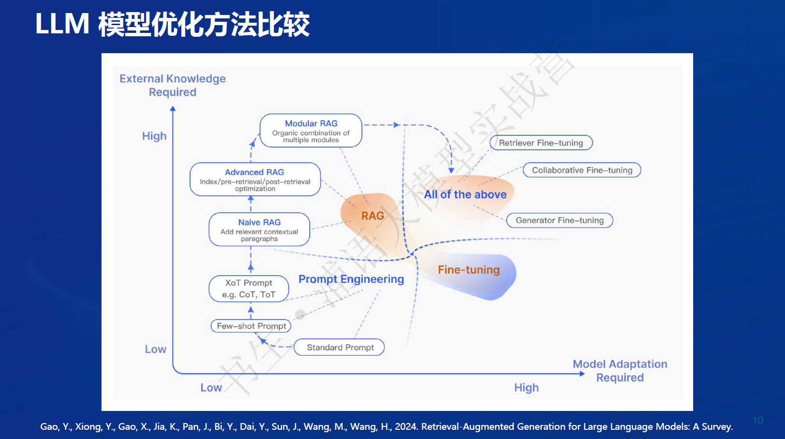

# 搭建 RAG 智能助理笔记

## RAG 技术概述

**定义：**
- RAG（Retrieval-Augmented Generation）结合检索（Retrieval）和生成（Generation），通过利用外部知识库增强大型语言模型（LLMs）的性能。

**主要目标：**
- 提供更准确、丰富的回答。
- 解决知识密集型任务中的挑战，降低推理成本，提供外部记忆支持。

## RAG 工作原理

1. **索引（Indexing）：**
   - 将知识源（如文档或网页）分割成小块，编码成向量，并存储在向量数据库中。

2. **查询（Query）：**
   - 用户问题编码成向量，在向量数据库中找到最相关的文档块。

3. **检索（Retrieval）：**
   - 使用向量数据库根据用户查询向量找出最相关的向量。

4. **生成（Generation）：**
   - 将检索到的文档块与原始问题作为提示输入到LLM中，生成最终回答。

## 向量数据库（Vector-DB）

**功能：**
- 根据用户的查询向量快速找出最相关的向量。
- 通过计算余弦相似度或其他相似性度量进行排序。
- 使用高级文本编码技术如句子嵌入、段落嵌入进行优化。

## RAG 发展进程

1. **Naive RAG：**
   - 用于问答系统、信息检索。

2. **Advanced RAG：**
   - 摘要生成、内容推荐。

3. **Modular RAG：**
   - 多模态任务、对话系统。

## RAG 常见优化方法

1. **索引优化（Indexing Optimization）：**
   - 细粒度分割、元数据优化。

2. **查询优化（Query Optimization）：**
   - 查询扩展、转换，多查询策略。

3. **嵌入优化（Embedding Optimization）：**
   - 结合稀疏和密集检索，多任务优化。

4. **上下文管理（Context Curation）：**
   - 重排、上下文选择与压缩。

5. **LLM 微调（Fine-tuning）：**
   - 检索微调、生成微调、双重微调。

6. **迭代检索（Iterative Retrieval）：**
   - 初始查询基础上的重复搜索。

7. **递归检索（Recursive Retrieval）：**
   - 迭代细化搜索查询、链式推理。

8. **自适应检索（Adaptive Retrieval）：**
   - 使用LLMs主动决定检索的最佳时机和内容。

## RAG vs. 微调（Fine-tuning）

**RAG：**
- 非参数记忆，利用外部知识库实时更新信息。
- 处理知识密集型任务，生成多样化内容。
- 适用于结合最新信息和实时数据的任务。

**微调：**
- 参数记忆，通过特定任务数据训练。
- 通常需要大量标注数据，可能导致过拟合。
- 适用于需要模型高度专业化的任务。

## 评估框架和基准测试

**经典评估指标：**
- 准确率（Accuracy）、召回率（Recall）、F1 分数（F1 Score）、BLEU 分数、ROUGE 分数。

**RAG 评测框架：**
- 基准测试 - RGB、RECALL、CRUD。
- 评测工具 - RAGAS、ARES、TruLens。
#

## 茴香豆

**介绍：**
- 茴香豆是基于LLMs的领域知识助手，专为即时通讯（IM）工具中的群聊场景优化。
- 通过应用RAG技术，提供及时准确的技术支持和自动化问答服务。

**核心特性：**
- BSD-3-Clause免费商用，支持多种IM软件。
- 应用RAG技术，快速获取专业知识。
- 兼容多种开源LLMs和云端API，保护数据和用户隐私。

**构建步骤：**
1. **多来源检索：**
   - 向量数据库、网络搜索结果、混合文件夹。

2. **混合大模型：**
   - 本地LLM、远程LLM。

3. **多重评分和拒答工作流：**
   - 回答有效，避免信息泛滥。

4. **安全检查：**
   - 确保回答合规。

