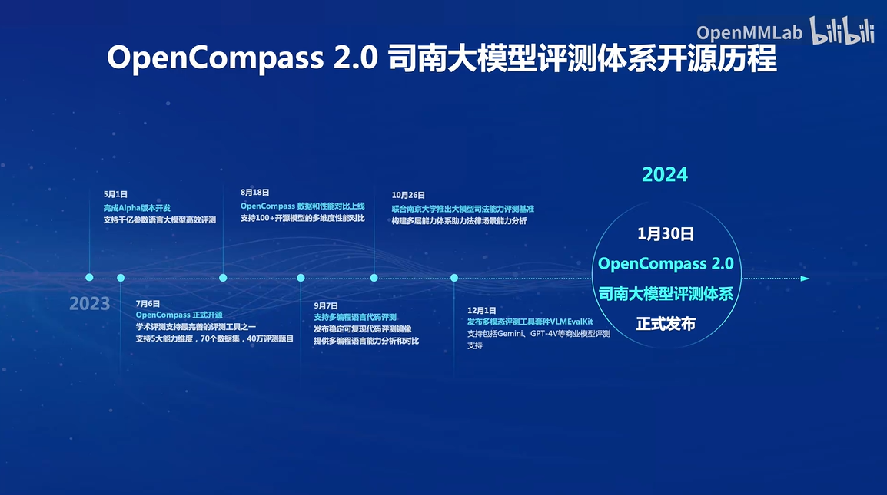
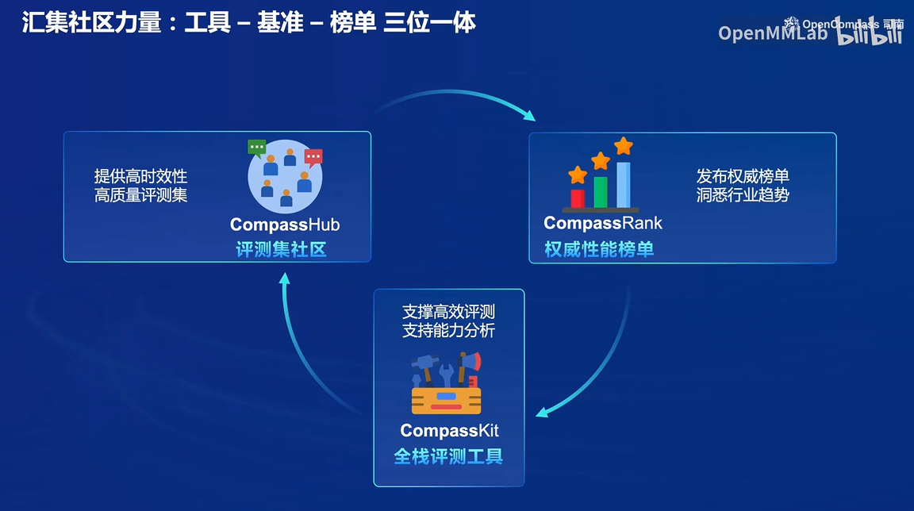
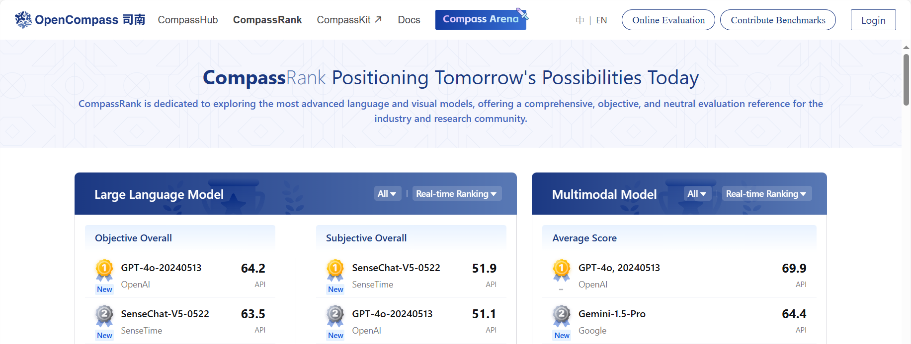
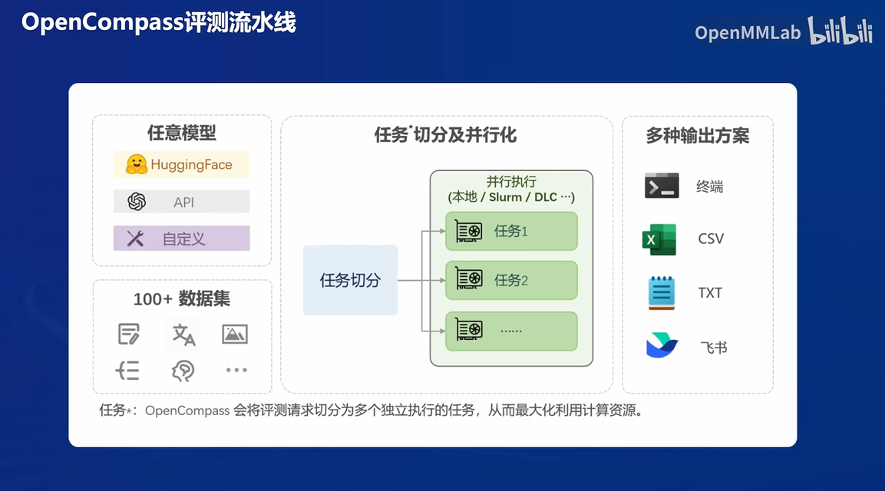

# 单元7：OpenCompass 大模型评测实战

#### 研究大模型评测的必要性

研究大模型评测对于全面了解其优势和局限性至关重要。尽管大模型在许多任务上表现出色，但我们仍需质疑其能力是否源于真正的理解，还是仅仅对训练数据的记忆。例如，即使只提供LeetCode题目编号，大模型也能正确输出答案，这暗示着训练数据可能存在污染现象。因此，研究评测不仅能揭示这些问题，还能为模型的改进提供指导。

研究评测还可以帮助我们改进人机交互的协同工作。大模型的最终服务对象是人类，全面评估模型的各项能力有助于设计更好的交互范式，从而提升用户体验。

此外，研究评测还能帮助我们规划大模型的未来发展，并预防潜在的风险。通过合理科学的评测机制，我们可以从进化的角度评估模型的能力，提前预测并规避潜在风险。这对于研究人员和产品开发者而言，同样具有重要意义。

#### 模型评估的意义和基础

模型评估在人工智能领域至关重要，不仅帮助我们了解模型的性能，还为模型的优化和改进提供关键反馈。有效的模型评估可以推动技术进步，帮助我们构建更智能、更高效的系统。

- **综合能力评估**：现代大模型被应用于多种任务，如数学计算、编程和语言理解等。评测需要涵盖这些不同的能力，以全面评估模型的综合表现。例如，评估一个模型在数学问题上的解答能力，可以帮助确定其逻辑推理能力的强弱。
- **垂直领域评估**：随着大模型在医疗、法律等专业领域的应用增多，需要开发针对这些领域的专门评测方法，以准确评估模型在特定领域的适用性。比如，在医疗领域，评估模型能否正确解读医学影像和文本，从而辅助医生做出诊断。
- **中文能力评估**：中文社区的大模型发展需要专门的评测工具，这些工具能够准确评估模型的中文处理能力，推动中文自然语言处理技术的进步。中文评测不仅包括基本的语言理解，还涉及到复杂的语境处理和文化背景知识。
- **模型迭代改进**：通过评测，可以发现模型的优缺点，指导下一步的改进方向，从而提高模型的整体性能。定期的评测和反馈可以帮助模型不断适应新的应用场景和用户需求。

#### 大模型评测的挑战

评测大模型面临多方面的挑战，这些挑战包括但不限于全面性、成本、数据污染和鲁棒性。

- **全面性**：由于大模型的应用场景多种多样，评测方案必须足够全面，以覆盖所有可能的使用场景。同时，随着模型能力的快速提升，评测体系需要具备扩展性，以应对未来的变化。例如，针对社交媒体内容生成和分析的评测，需要涵盖情感分析、话题检测等多个方面。
- **评测成本**：大规模评测需要大量计算资源，这在本地运行时成本极高。此外，通过API进行评测也会产生高昂的费用。人工打分的主观评测虽然精确，但成本更加高昂。为降低成本，可以探索半自动化评测方法，结合人工和自动化手段，提高评测效率。
- **数据污染**：大模型的训练语料库往往非常庞大，难以完全避免数据污染。需要开发可靠的数据污染检测技术，并设计出动态更新的高质量评测基准，以确保评测结果的准确性。例如，使用去重算法和数据清洗技术，可以有效减少训练数据中的冗余和噪声。
- **鲁棒性**：大模型对提示词非常敏感，提示词的设计直接影响评测结果。此外，模型的输出可能不稳定，需要多次采样以获取准确的性能评估。设计鲁棒的提示词和多次采样策略，可以更全面地反映模型的真实能力。

#### OpenCompass 的优势与功能

OpenCompass 是一个强大的模型评测平台，提供了丰富的功能和工具，以满足不同模型和数据集的评测需求。其特点包括实时榜单、灵活的评测方式、以及全面的评测工具链。

- **实时榜单**：OpenCompass 提供实时榜单，展示各大模型的最新性能数据，帮助用户了解当前最先进的模型。榜单不仅显示模型的综合排名，还提供各项能力的详细评分，便于用户进行比较和分析。
- **评测方式**：对于开源模型，使用 GPU 或推理加速卡在本地进行评测；对于闭源模型，通过 API 进行远程评测。这样既能保证评测的灵活性，又能覆盖不同类型的模型。这种双轨制的评测方式，可以根据具体需求选择最合适的评测手段。
- **提示工程**：在评测过程中，提示词的设计至关重要。好的提示词应具有以下特点：明确、无歧义，并能够引导模型逐步完成任务。OpenCompass 的提示工程优化有助于全面反映模型的综合能力。例如，通过引入上下文信息和多步指令，可以提高提示词的有效性。

#### 长文本评测与创新

长文本评测是 OpenCompass 的一大亮点，通过在长文档中插入特定句子并要求模型找到它，测试模型的记忆能力和信息检索能力。这种“大海捞针”式的评测方法能够深入考察模型在处理长文本时的表现。长文本评测还可以用于评估模型在阅读理解、摘要生成等任务中的能力。

#### 亮点功能与技术创新

OpenCompass 提供了全栈评测工具链，涵盖了从数据污染检查到多种模型推理的全方位支持。

- **数据污染检查**：提供多种数据污染检测方法，确保评测数据的纯净度。比如，利用统计分析和机器学习方法，可以检测和过滤潜在的污染数据，提高评测结果的可信度。
- **多种模型推理支持**：支持主流商业模型 API，以及 LMDeploy、vLLM、LightLLM 等多种推理后端，满足不同用户的需求。这种多样化的支持，可以灵活适应不同应用场景和技术环境。
- **长文本能力评测**：支持一百万长度的长文本评测，能够深入测试模型在长文本场景下的表现。长文本能力评测包括但不限于文档摘要、主题提取和细节记忆等多个方面。
- **双语主观评测**：支持中英文双语评测，提供灵活的模型打分和模型对战功能，能够全面评估模型的语言能力。双语评测有助于提升模型在多语言环境中的适应性和通用性。
- **评测流水线**：支持任意模型在任意数据集上的评测，并能够切分任务并行处理，充分利用计算资源。评测流水线的自动化和并行化设计，可以显著提高评测效率和准确性。

#### 自研高质量评测数据集

为了进一步提升评测的全面性和准确性，OpenCompass 自主研发了多种高质量评测数据集，这些数据集覆盖了不同领域和能力维度：

- **MathBench**：综合考察不同难度和不同语言、来源的数学能力。例如，通过设置不同类型的数学题目，可以评估模型在算术、代数、几何等方面的表现。
- **CIBench**：专注于模型的代码解释能力，支持 Pandas、Matplotlib、Scikit-learn、Pytorch 等工具的测试。代码解释能力评测可以帮助了解模型在编程辅助和代码理解任务中的应用潜力。
- **T-Eval**：评估模型的工具利用能力，包括指令遵循、计划、推理、检索、理解和审查等多个子过程。通过模拟真实的任务场景，T-Eval 可以全面评估模型在复杂任务中的表现。

#### CompassRank 大模型榜单
[ CompassRank 大模型榜单](https://rank.opencompass.org.cn/home)

### 快速上手OpenCompass
参考教程链接[快速上手OpenCompass](https://github.com/InternLM/Tutorial/blob/camp2/opencompass/readme.md#%E5%BF%AB%E9%80%9F%E5%BC%80%E5%A7%8B)

### 总结

OpenCompass 是一个功能强大、灵活多样的大模型评测平台。通过全面的评测工具链和高质量的数据集，OpenCompass 能够准确评估模型的多种能力和性能，为模型的优化和改进提供宝贵的参考。随着技术的不断进步和需求的变化，OpenCompass 将继续创新和发展，推动人工智能技术的前沿探索和应用。