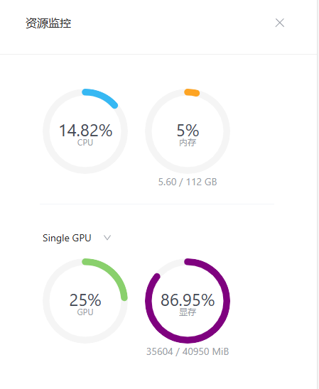

# 第二节：玩转大模型趣味Demo——homework
## 1、基础作业

### 1.1实战部署InternLM2-Chat-1.8B


### 1.2 体验书生·浦语 Web
使用[书生·浦语 Web](https://internlm-chat.intern-ai.org.cn/) 和浦语对话

## 2.进阶作业
### 作业1
熟悉 `huggingface` 下载功能，使用 `huggingface_hub` python 包，下载 `InternLM2-Chat-7B` 的 `config.json` 文件到本地（需截图下载过程）

### 作业2
完成 `浦语·灵笔2` 的 `图文创作` 及 `视觉问答` 部署（需截图）

#### 图文创作


#### 视觉问答


> 这里遇到了问题没有解决：带上图片后就卡死在这个地方了，没有输出。
```
init
<object object at 0x7f7d9d3d2080>
```
### 作业3
完成 `Lagent` 工具调用 `数据分析` Demo 部署（需截图）

