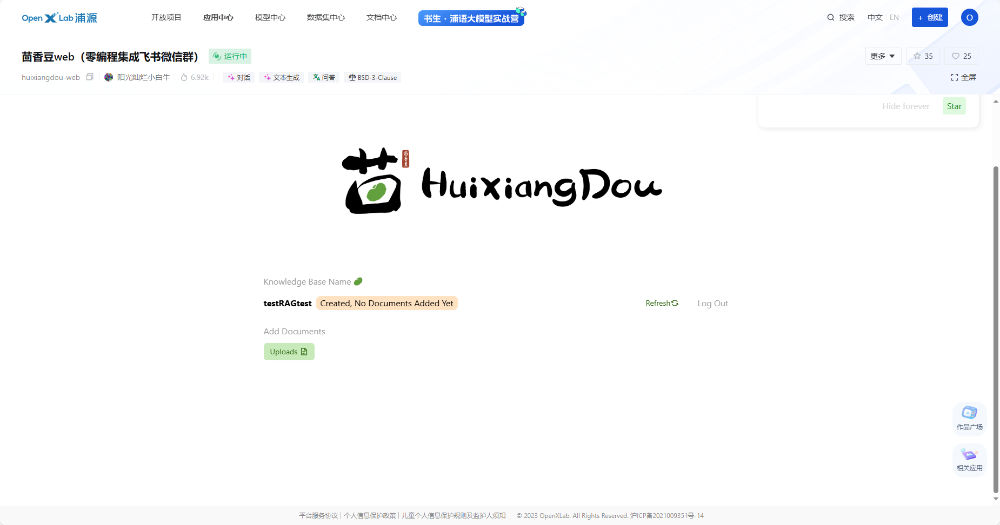
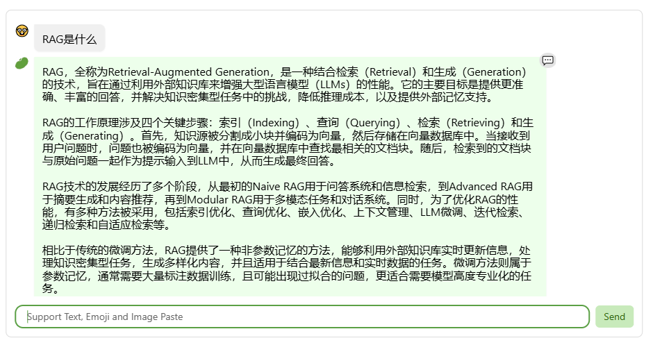
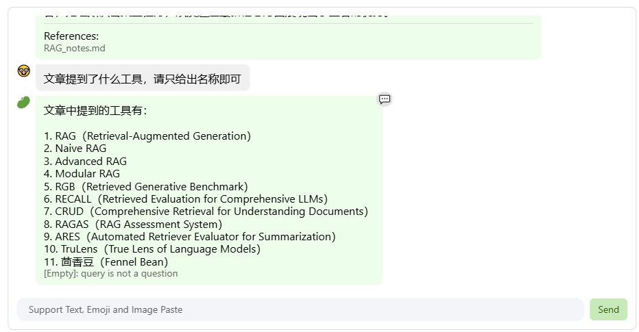
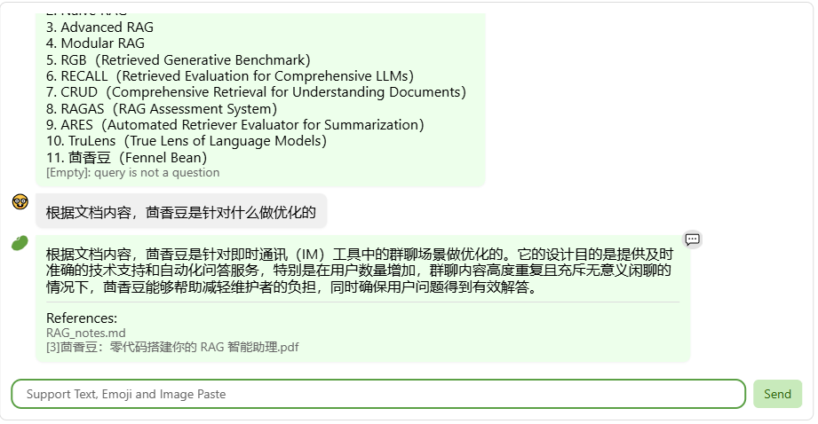
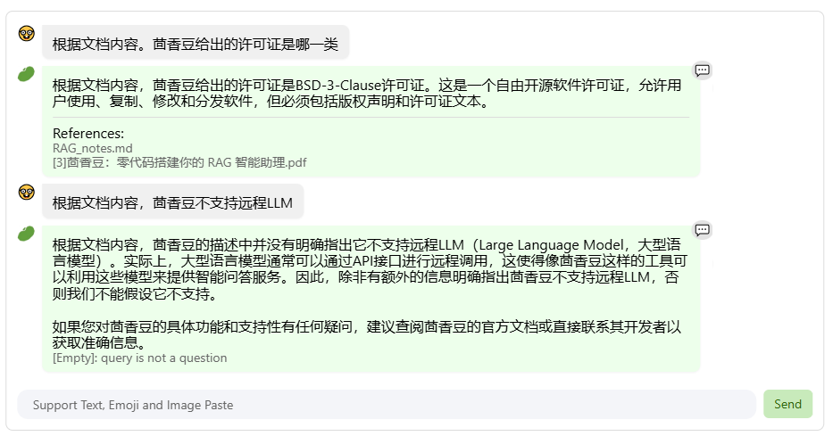
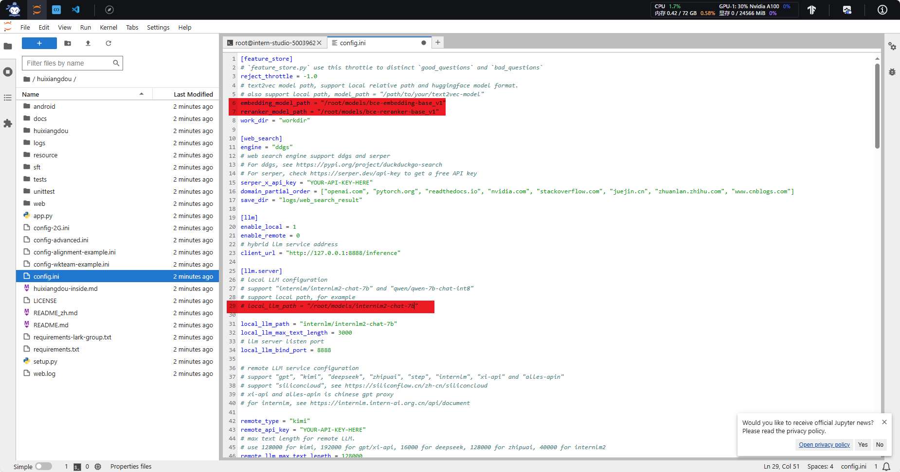
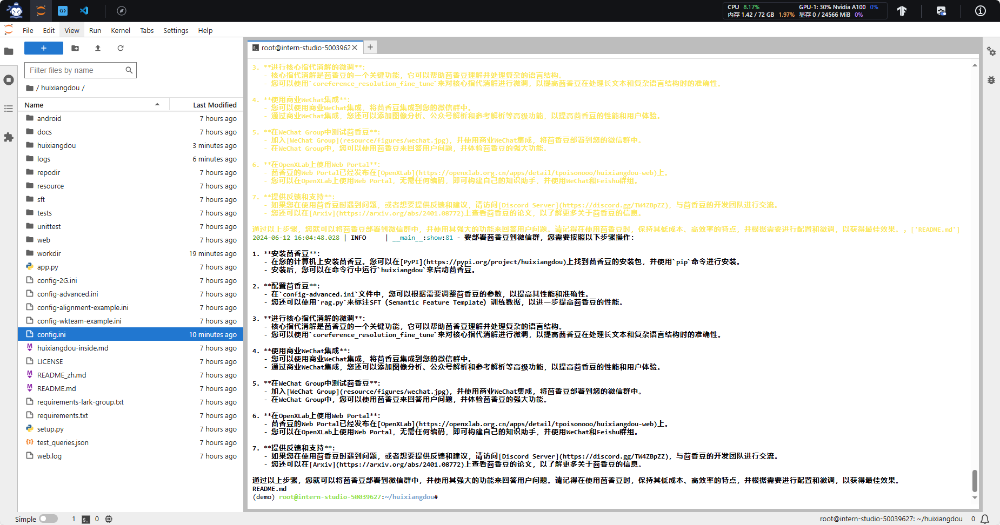

[基础作业](#基础作业)
- [在茴香豆 Web 版中创建自己领域的知识问答助手](#作业1)
- [在 `InternLM Studio` 上部署茴香豆技术助手](#作业2)

# 第三课作业
> ## 基础作业 - 任意选一个作业
> 
> ### 1. 在[茴香豆 Web 版](https://openxlab.org.cn/apps/detail/tpoisonooo/huixiangdou-web)中创建自己领域的知识问答助手
> 
> - 参考视频[零编程玩转大模型，学习茴香豆部署群聊助手](https://www.> bilibili.com/video/BV1S2421N7mn)
> - 完成不少于 400 字的笔记 + 线上茴香豆助手对话截图(不少于5轮)
> - （可选）参考 [代码](https://github.com/InternLM/HuixiangDou/tree/main/web) 在自己的服务器部署茴香豆 Web 版
> 
> ### 2.在 `InternLM Studio` 上部署茴香豆技术助手
> 
> - 根据教程文档搭建 `茴香豆技术助手`，针对问题"茴香豆怎么部署到微信群？"进行提问
> - 完成不少于 400 字的笔记 + 截图
> 
> 
> ## 进阶作业 （作业难度非常难, 不用纠结，请先学完后续的课程内容再来做此处的进阶作业～） 
> 
> ### A.【应用方向】 结合自己擅长的领域知识（游戏、法律、电子等）、专业背景，搭建个人工作助手或者垂直领域问答助手，参考茴香豆官方文档，部署到下列任一平台。
>   - 飞书、微信
>   - 可以使用 茴香豆 Web 版 或 InternLM Studio 云端服务器部署
>   - 涵盖部署全过程的作业报告和个人助手问答截图
> 
> ### B.【算法方向】尝试修改 `good_questions.json`、调试 prompt 或应用其他 NLP 技术，如其他 chunk 方法，提高个人工作助手的表现。
>   - 完成不少于 400 字的笔记 ，记录自己的尝试和调试思路，涵盖全过程和改进效果截图
> 
> ## 大作业项目选题
> 
> ### A.【工程方向】 参与贡献茴香豆前端，将茴香豆助手部署到下列平台
>  - Github issue、Discord、钉钉、X
> ### B.【应用方向】 茴香豆RAG-Agent
>   - 应用茴香豆建立一个 ROS2 的机器人Agent
> ### C.【算法方向】 茴香豆多模态
>   - 参与茴香豆多模态的工作

# 基础作业
<h2 id="作业1">1. 在茴香豆 Web 版中创建自己领域的知识问答助手</h2>

> [茴香豆 Web 版](https://openxlab.org.cn/apps/detail/tpoisonooo/huixiangdou-web)  
> [视频教程](https://www.bilibili.com/video/BV1S2421N7mn/?vd_source=6943e62d2d31d4f9b35eab2d01537871)









<h2 id="作业2">2.在 `InternLM Studio` 上部署茴香豆技术助手</h2>


继续使用02demo创建的开发机和环境
```bash
conda activate demo
```
只需要执行以下两条命令建立快捷方式
```bash
# 复制BCE模型
ln -s /root/share/new_models/maidalun1020/bce-embedding-base_v1 /root/models/bce-embedding-base_v1
ln -s /root/share/new_models/maidalun1020/bce-reranker-base_v1 /root/models/bce-reranker-base_v1
```
安装茴香豆运行所需依赖。
```bash
# 安装 python 依赖
# pip install -r requirements.txt

pip install protobuf==4.25.3 accelerate==0.28.0 aiohttp==3.9.3 auto-gptq==0.7.1 bcembedding==0.1.3 beautifulsoup4==4.8.2 einops==0.7.0 faiss-gpu==1.7.2 langchain==0.1.14 loguru==0.7.2 lxml_html_clean==0.1.0 openai==1.16.1 openpyxl==3.1.2 pandas==2.2.1 pydantic==2.6.4 pymupdf==1.24.1 python-docx==1.1.0 pytoml==0.1.21 readability-lxml==0.8.1 redis==5.0.3 requests==2.31.0 scikit-learn==1.4.1.post1 sentence_transformers==2.2.2 textract==1.6.5 tiktoken==0.6.0 transformers==4.39.3 transformers_stream_generator==0.0.5 unstructured==0.11.2

## 因为 Intern Studio 不支持对系统文件的永久修改，在 Intern Studio 安装部署的同学不建议安装 Word 依赖，后续的操作和作业不会涉及 Word 解析。
## 想要自己尝试解析 Word 文件的同学，uncomment 掉下面这行，安装解析 .doc .docx 必需的依赖
# apt update && apt -y install python-dev python libxml2-dev libxslt1-dev antiword unrtf poppler-utils pstotext tesseract-ocr flac ffmpeg lame libmad0 libsox-fmt-mp3 sox libjpeg-dev swig libpulse-dev
```
从茴香豆官方仓库下载茴香豆。
```bash
cd /root
# 克隆代码仓库
git clone https://github.com/internlm/huixiangdou && cd huixiangdou
git checkout b9bc427

```
用已下载模型的路径替换 `/root/huixiangdou/config.ini` 文件中的默认模型，需要修改 3 处模型地址，

> 修改用于向量数据库和词嵌入的模型,第6行
> 
> ```bash
> embedding_model_path = "/root/models/bce-embedding-base_v1"
> 
> ```
> 
> 用于检索的重排序模型,第6行
> 
> ```bash
> reranker_model_path = "/root/models/bce-reranker-base_v1"
> ```
> 
> 和本次选用的大模型,第29行
> ```bash
> local_llm_path = "/root/models/internlm2-chat-7b"
> ```

下载 **Huixiangdou** 语料：

```bash
cd /root/huixiangdou && mkdir repodir

git clone https://github.com/internlm/huixiangdou --depth=1 repodir/huixiangdou

```
提取知识库特征，创建向量数据库。数据库向量化的过程应用到了 **LangChain** 的相关模块，默认嵌入和重排序模型调用的网易 **BCE 双语模型**，如果没有在 `config.ini` 文件中指定本地模型路径，茴香豆将自动从 **HuggingFace**  拉取默认模型。

除了语料知识的向量数据库，茴香豆建立接受和拒答两个向量数据库，用来在检索的过程中更加精确的判断提问的相关性，这两个数据库的来源分别是：

- 接受问题列表，希望茴香豆助手回答的示例问题
  - 存储在 `huixiangdou/resource/good_questions.json` 中
- 拒绝问题列表，希望茴香豆助手拒答的示例问题
  - 存储在 `huixiangdou/resource/bad_questions.json` 中
  - 其中多为技术无关的主题或闲聊
  - 如："nihui 是谁", "具体在哪些位置进行修改？", "你是谁？", "1+1"

运行下面的命令，增加茴香豆相关的问题到接受问题示例中：

```bash
cd /root/huixiangdou
mv resource/good_questions.json resource/good_questions_bk.json

echo '[
    "mmpose中怎么调用mmyolo接口",
    "mmpose实现姿态估计后怎么实现行为识别",
    "mmpose执行提取关键点命令不是分为两步吗，一步是目标检测，另一步是关键点提取，我现在目标检测这部分的代码是demo/topdown_demo_with_mmdet.py demo/mmdetection_cfg/faster_rcnn_r50_fpn_coco.py checkpoints/faster_rcnn_r50_fpn_1x_coco_20200130-047c8118.pth   现在我想把这个mmdet的checkpoints换位yolo的，那么应该怎么操作",
    "在mmdetection中，如何同时加载两个数据集，两个dataloader",
    "如何将mmdetection2.28.2的retinanet配置文件改为单尺度的呢？",
    "1.MMPose_Tutorial.ipynb、inferencer_demo.py、image_demo.py、bottomup_demo.py、body3d_pose_lifter_demo.py这几个文件和topdown_demo_with_mmdet.py的区别是什么，\n2.我如果要使用mmdet是不是就只能使用topdown_demo_with_mmdet.py文件，",
    "mmpose 测试 map 一直是 0 怎么办？",
    "如何使用mmpose检测人体关键点？",
    "我使用的数据集是labelme标注的，我想知道mmpose的数据集都是什么样式的，全都是单目标的数据集标注，还是里边也有多目标然后进行标注",
    "如何生成openmmpose的c++推理脚本",
    "mmpose",
    "mmpose的目标检测阶段调用的模型，一定要是demo文件夹下的文件吗，有没有其他路径下的文件",
    "mmpose可以实现行为识别吗，如果要实现的话应该怎么做",
    "我在mmyolo的v0.6.0 (15/8/2023)更新日志里看到了他新增了支持基于 MMPose 的 YOLOX-Pose，我现在是不是只需要在mmpose/project/yolox-Pose内做出一些设置就可以，换掉demo/mmdetection_cfg/faster_rcnn_r50_fpn_coco.py 改用mmyolo来进行目标检测了",
    "mac m1从源码安装的mmpose是x86_64的",
    "想请教一下mmpose有没有提供可以读取外接摄像头，做3d姿态并达到实时的项目呀？",
    "huixiangdou 是什么？",
    "使用科研仪器需要注意什么？",
    "huixiangdou 是什么？",
    "茴香豆 是什么？",
    "茴香豆 能部署到微信吗？",
    "茴香豆 怎么应用到飞书",
    "茴香豆 能部署到微信群吗？",
    "茴香豆 怎么应用到飞书群",
    "huixiangdou 能部署到微信吗？",
    "huixiangdou 怎么应用到飞书",
    "huixiangdou 能部署到微信群吗？",
    "huixiangdou 怎么应用到飞书群",
    "huixiangdou",
    "茴香豆",
    "茴香豆 有哪些应用场景",
    "huixiangdou 有什么用",
    "huixiangdou 的优势有哪些？",
    "茴香豆 已经应用的场景",
    "huixiangdou 已经应用的场景",
    "huixiangdou 怎么安装",
    "茴香豆 怎么安装",
    "茴香豆 最新版本是什么",
    "茴香豆 支持哪些大模型",
    "茴香豆 支持哪些通讯软件",
    "config.ini 文件怎么配置",
    "remote_llm_model 可以填哪些模型?"
]' > /root/huixiangdou/resource/good_questions.json

  ```

再创建一个测试用的问询列表，用来测试拒答流程是否起效：

```bash
cd /root/huixiangdou

echo '[
"huixiangdou 是什么？",
"你好，介绍下自己"
]' > ./test_queries.json

  ```

在确定好语料来源后，运行下面的命令，创建 RAG 检索过程中使用的向量数据库：

```bash
# 创建向量数据库存储目录
cd /root/huixiangdou && mkdir workdir 
# 安装缺少的库
pip install -U duckduckgo_search

# 分别向量化知识语料、接受问题和拒绝问题中后保存到 workdir
python3 -m huixiangdou.service.feature_store --sample ./test_queries.json

```

向量数据库的创建需要等待一小段时间，过程约占用 1.6G 显存。

完成后，**Huixiangdou** 相关的新增知识就以向量数据库的形式存储在 `workdir` 文件夹下。  

命令行运行：

```bash
# 填入问题
sed -i '74s/.*/    queries = ["huixiangdou 是什么？", "茴香豆怎么部署到微信群", "今天天气怎么样？"]/' /root/huixiangdou/huixiangdou/main.py

# 运行茴香豆
cd /root/huixiangdou/
python3 -m huixiangdou.main --standalone

```

