[基础作业]( ##基础作业)
[进阶作业]( ## 进阶作业)
- [部署到OpenCLab](###部署到OpenCLab)
- [复现多模态微调](###复现多模态微调)
# 第 4 节课作业

> 记录复现过程并截图
> 
> ## 基础作业（结营必做）
> 
> - 训练自己的小助手认知（记录复现过程并截图）
> 
> ## 进阶作业
> 
> - 将自我认知的模型上传到 OpenXLab，并将应用部署到 OpenXLab（优秀学员必做）
> - 复现多模态微调（优秀学员必做）
> 
> 
> OpenXLab 部署教程：https://github.com/InternLM/Tutorial/tree/camp2/tools/openxlab-deploy

# 基础作业
用 `QLoRA` 的方式来微调一个自己的小助手！

## 1 开发机准备
前往 [InternStudio](https://studio.intern-ai.org.cn/) 中创建一个开发机进行使用。
## 2 快速上手
简单了解一下 XTuner 的运行原理。

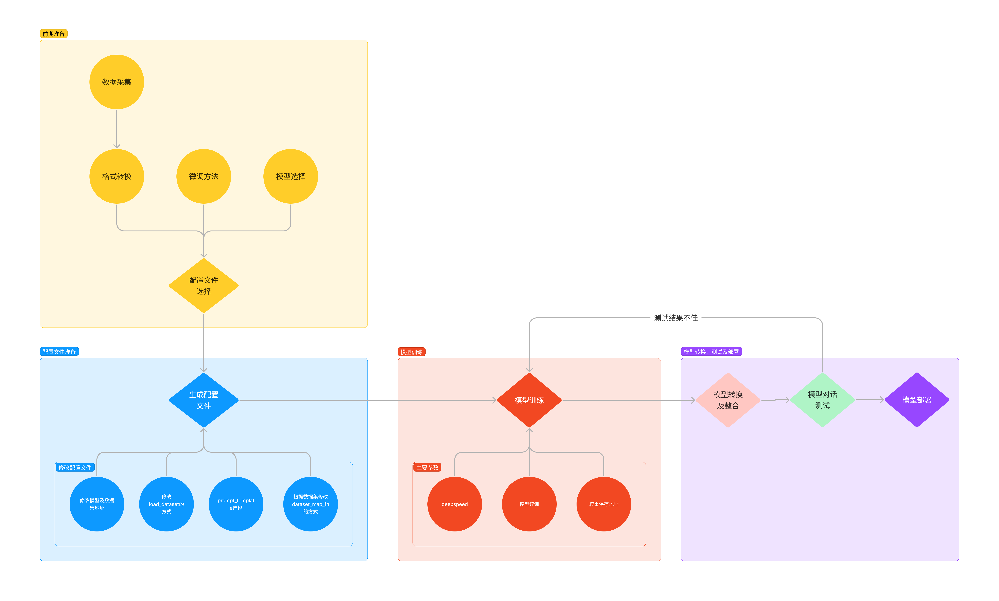

1. **环境安装**：假如我们想要用 XTuner 这款简单易上手的微调工具包来对模型进行微调的话，那我们最最最先开始的第一步必然就是安装XTuner！安装基础的工具是一切的前提，只有安装了 XTuner 在我们本地后我们才能够去思考说具体怎么操作。

2. **前期准备**：那在完成了安装后，我们下一步就需要去明确我们自己的微调目标了。我们想要利用微调做一些什么事情呢，那我为了做到这个事情我有哪些硬件的资源和数据呢？假如我们有对于一件事情相关的数据集，并且我们还有足够的算力资源，那当然微调就是一件水到渠成的事情。就像 OpenAI 不就是如此吗？但是对于普通的开发者而言，在资源有限的情况下，我们可能就需要考虑怎么采集数据，用什么样的手段和方式来让模型有更好的效果。

3. **启动微调**：在确定了自己的微调目标后，我们就可以在 XTuner 的配置库中找到合适的配置文件并进行对应的修改。修改完成后即可一键启动训练！训练好的模型也可以仅仅通过在终端输入一行指令来完成转换和部署工作！


### 2.1 环境安装
首先我们需要先安装一个 XTuner 的源码到本地来方便后续的使用。
```bash
# 如果你是在 InternStudio 平台，则从本地 clone 一个已有 pytorch 的环境：
# pytorch    2.0.1   py3.10_cuda11.7_cudnn8.5.0_0

studio-conda xtuner0.1.17
# 如果你是在其他平台：
# conda create --name xtuner0.1.17 python=3.10 -y

# 激活环境
conda activate xtuner0.1.17
# 进入家目录 （~的意思是 “当前用户的home路径”）
cd ~
# 创建版本文件夹并进入，以跟随本教程
mkdir -p /root/xtuner0117 && cd /root/xtuner0117

# 拉取 0.1.17 的版本源码
git clone -b v0.1.17  https://github.com/InternLM/xtuner
# 无法访问github的用户请从 gitee 拉取:
# git clone -b v0.1.15 https://gitee.com/Internlm/xtuner

# 进入源码目录
cd /root/xtuner0117/xtuner

# 从源码安装 XTuner
pip install -e '.[all]'
```
> 假如速度太慢可以 `Ctrl + C` 退出后换成 `pip install -e '.[all]' -i https://mirrors.aliyun.com/pypi/simple/`

接下来就可以进入我们的第二步，准备好我们需要的数据集、模型和配置文件！

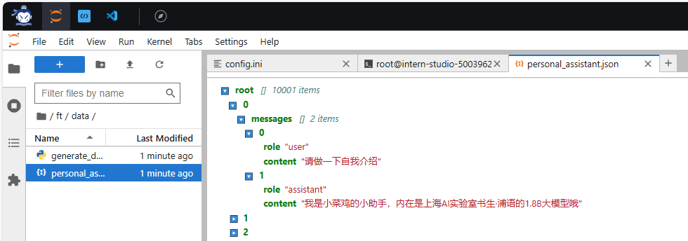
### 2.2 前期准备

#### 2.2.1 数据集准备

首先我们先创建一个文件夹来存放微调数据。

```bash
# 前半部分是创建一个文件夹，后半部分是进入该文件夹。
mkdir -p /root/ft && cd /root/ft

# 在ft这个文件夹里再创建一个存放数据的data文件夹
mkdir -p /root/ft/data && cd /root/ft/data
```

之后我们可以在 `data` 目录下新建一个 `generate_data.py` 文件，将以下代码复制进去，然后运行该脚本即可生成数据集。假如想要加大剂量让他能够完完全全认识到你的身份，那我们可以吧 `n` 的值调大一点。

```bash
# 创建 `generate_data.py` 文件
touch /root/ft/data/generate_data.py
```

打开该 python 文件后将[generate_data.py](codes_04/generate_data.py)下面的内容复制进去。


并将文件 `name` 后面的内容修改为你的名称。比如说我是小菜鸡的话就是：

```diff
# 将对应的name进行修改（在第4行的位置）
- name = '不要姜葱蒜大佬'
+ name = "小菜鸡"
```

修改完成后运行 `generate_data.py` 文件即可。

``` bash
# 确保先进入该文件夹
cd /root/ft/data

# 运行代码
python /root/ft/data/generate_data.py
```
可以看到在data的路径下便生成了一个名为 `personal_assistant.json` 的文件，这样我们最可用于微调的数据集就准备好啦！里面就包含了 5000 条 `input` 和 `output` 的数据对。假如 我们认为 5000 条不够的话也可以调整文件中第6行 `n` 的值哦！

```
|-- data/
    |-- personal_assistant.json
    |-- generate_data.py
```

<details>
<summary>文件结构树代码</summary>

[tree.py](/tree.py)  
文件结构树代码如下所示，使用方法为在终端调用该代码的同时在后方输入文件夹路径。

比如说我要打印 `data` 的文件结构树，假设我的代码文件保存在 `/root/tree.py` ，那我就要在终端输入 `python /root/tree.py /root/ft/data` 


</details>

> 除了我们自己通过脚本的数据集，其实网上也有大量的开源数据集可以供我们进行使用。有些时候我们可以在开源数据集的基础上添加一些我们自己独有的数据集，也可能会有很好的效果。

#### 2.2.2 模型准备

使用 InternLM 最新推出的小模型 `InterLM2-Chat-1.8B` 来完成此次的微调演示。

在 InternStudio 上可以不用通过 OpenXLab 或者 Modelscope 进行模型的下载。

为避免存储空间不足，通过以下代码一键通过符号链接的方式链接到模型文件，这样既节省了空间，也便于管理。

```bash
# 删除/root/ft/model目录
rm -rf /root/ft/model

# 创建符号链接
ln -s /root/share/new_models/Shanghai_AI_Laboratory/internlm2-chat-1_8b /root/ft/model
```
执行上述操作后，`/root/ft/model` 将直接成为一个符号链接，这个链接指向 `/root/share/new_models/Shanghai_AI_Laboratory/internlm2-chat-1_8b` 的位置。

这意味着，当我们访问 `/root/ft/model` 时，实际上就是在访问 `/root/share/new_models/Shanghai_AI_Laboratory/internlm2-chat-1_8b` 目录下的内容。通过这种方式，我们无需复制任何数据，就可以直接利用现有的模型文件进行后续的微调操作，从而节省存储空间并简化文件管理。

在该情况下的文件结构如下所示。
```
|-- model/
    |-- tokenizer.model
    |-- config.json
    |-- .mdl
    |-- tokenization_internlm2.py
    |-- model-00002-of-00002.safetensors
    |-- tokenizer_config.json
    |-- model-00001-of-00002.safetensors
    |-- model.safetensors.index.json
    |-- configuration.json
    |-- .msc
    |-- special_tokens_map.json
    |-- .mv
    |-- modeling_internlm2.py
    |-- README.md
    |-- configuration_internlm2.py
    |-- generation_config.json
    |-- tokenization_internlm2_fast.py
```


#### 2.2.3 配置文件选择

XTuner 提供多个开箱即用的配置文件，用户可以通过下列命令查看：
> 开箱即用意味着假如能够连接上 Huggingface 以及有足够的显存，其实就可以直接运行这些配置文件，XTuner就能够直接下载好这些模型和数据集然后开始进行微调
```Bash
# 列出所有内置配置文件
# xtuner list-cfg

# 假如我们想找到 internlm2-1.8b 模型里支持的配置文件
xtuner list-cfg -p internlm2_1_8b
```
虽然我们用的数据集并不是 `alpaca` 而是我们自己通过脚本制作的小助手数据集 ，但是由于我们是通过 `QLoRA` 的方式对 `internlm2-chat-1.8b` 进行微调。而最相近的配置文件应该就是 `internlm2_1_8b_qlora_alpaca_e3` ，因此我们可以选择拷贝这个配置文件到当前目录：
```Bash
# 创建一个存放 config 文件的文件夹
mkdir -p /root/ft/config

# 使用 XTuner 中的 copy-cfg 功能将 config 文件复制到指定的位置
xtuner copy-cfg internlm2_1_8b_qlora_alpaca_e3 /root/ft/config
```
> 这里我们就用到了 XTuner 工具箱中的第二个工具 `copy-cfg` ，该工具有两个必须要填写的参数 `{CONFIG_NAME}` 和 `{SAVE_PATH}` ，在我们的输入的这个指令中，我们的 `{CONFIG_NAME}` 对应的是上面搜索到的 `internlm2_1_8b_qlora_alpaca_e3` ,而 `{SAVE_PATH}` 则对应的是刚刚新建的 `/root/ft/config`。我们假如需要复制其他的配置文件只需要修改这两个参数即可实现。
输入后我们就能够看到在我们的 `/root/ft/config` 文件夹下有一个名为 `internlm2_1_8b_qlora_alpaca_e3_copy.py` 的文件了。
```
|-- config/
    |-- internlm2_1_8b_qlora_alpaca_e3_copy.py
```
#### 2.2.4 小结

经过了以上的步骤后，我们的 `ft` 文件夹里应该是这样的：
```
|-- ft/
    |-- config/
        |-- internlm2_1_8b_qlora_alpaca_e3_copy.py
    |-- model/
        |-- tokenizer.model
        |-- config.json
        |-- tokenization_internlm2.py
        |-- model-00002-of-00002.safetensors
        |-- tokenizer_config.json
        |-- model-00001-of-00002.safetensors
        |-- model.safetensors.index.json
        |-- configuration.json
        |-- special_tokens_map.json
        |-- modeling_internlm2.py
        |-- README.md
        |-- configuration_internlm2.py
        |-- generation_config.json
        |-- tokenization_internlm2_fast.py
    |-- data/
        |-- personal_assistant.json
        |-- generate_data.py
```


### 2.3 配置文件修改

直接将以下代码复制到 `/root/ft/config/internlm2_1_8b_qlora_alpaca_e3_copy.py` 文件中（先 `Ctrl + A` 选中所有文件并删除后再将代码复制进去）。  
[internlm2_1_8b_qlora_alpaca_e3_copy.py](codes_04/internlm2_1_8b_qlora_alpaca_e3_copy.py)
<details>
<summary><b>参数修改细节</b></summary>

首先在 PART 1 的部分，由于我们不再需要在 Huggingface 上自动下载模型，因此我们先要更换模型的路径以及数据集的路径为我们本地的路径。
    
```diff
# 修改模型地址（在第27行的位置）
- pretrained_model_name_or_path = 'internlm/internlm2-1_8b'
+ pretrained_model_name_or_path = '/root/ft/model'

# 修改数据集地址为本地的json文件地址（在第31行的位置）
- alpaca_en_path = 'tatsu-lab/alpaca'
+ alpaca_en_path = '/root/ft/data/personal_assistant.json'
```

除此之外，我们还可以对一些重要的参数进行调整，包括学习率（lr）、训练的轮数（max_epochs）等等。由于我们这次只是一个简单的让模型知道自己的身份弟位，因此我们的训练轮数以及单条数据最大的 Token 数（max_length）都可以不用那么大。

```diff
# 修改max_length来降低显存的消耗（在第33行的位置）
- max_length = 2048
+ max_length = 1024

# 减少训练的轮数（在第44行的位置）
- max_epochs = 3
+ max_epochs = 2

# 增加保存权重文件的总数（在第54行的位置）
- save_total_limit = 2
+ save_total_limit = 3
```

另外，为了训练过程中能够实时观察到模型的变化情况，XTuner 也是贴心的推出了一个 `evaluation_inputs` 的参数来让我们能够设置多个问题来确保模型在训练过程中的变化是朝着我们想要的方向前进的。比如说我们这里是希望在问出 “请你介绍一下你自己” 或者说 “你是谁” 的时候，模型能够给你的回复是 “我是XXX的小助手...” 这样的回复。因此我们也可以根据这个需求进行更改。


``` diff
# 修改每多少轮进行一次评估（在第57行的位置）
- evaluation_freq = 500
+ evaluation_freq = 300

# 修改具体评估的问题（在第59到61行的位置）
# 可以自由拓展其他问题
- evaluation_inputs = ['请给我介绍五个上海的景点', 'Please tell me five scenic spots in Shanghai']
+ evaluation_inputs = ['请你介绍一下你自己', '你是谁', '你是我的小助手吗']
```
这样修改完后在评估过程中就会显示在当前的权重文件下模型对这几个问题的回复了。

由于我们的数据集不再是原本的 aplaca 数据集，因此我们也要进入 PART 3 的部分对相关的内容进行修改。包括说我们数据集输入的不是一个文件夹而是一个单纯的 json 文件以及我们的数据集格式要求改为我们最通用的 OpenAI 数据集格式。

``` diff
# 把 OpenAI 格式的 map_fn 载入进来（在第15行的位置）
- from xtuner.dataset.map_fns import alpaca_map_fn, template_map_fn_factory
+ from xtuner.dataset.map_fns import openai_map_fn, template_map_fn_factory

# 将原本是 alpaca 的地址改为是 json 文件的地址（在第102行的位置）
- dataset=dict(type=load_dataset, path=alpaca_en_path),
+ dataset=dict(type=load_dataset, path='json', data_files=dict(train=alpaca_en_path)),

# 将 dataset_map_fn 改为通用的 OpenAI 数据集格式（在第105行的位置）
- dataset_map_fn=alpaca_map_fn,
+ dataset_map_fn=openai_map_fn,
```


</details>


这一节我们讲述了微调过程中一些常见的需要调整的内容，包括各种的路径、超参数、评估问题等等。

### 2.4 模型训练

#### 2.4.1 常规训练

当我们准备好了配置文件好，我们只需要将使用 `xtuner train` 指令即可开始训练。

我们可以通过添加 `--work-dir` 指定特定的文件保存位置，比如说就保存在 `/root/ft/train` 路径下。假如不添加的话模型训练的过程文件将默认保存在 `./work_dirs/internlm2_1_8b_qlora_alpaca_e3_copy` 的位置，就比如说我是在 `/root/ft/train` 的路径下输入该指令，那么我的文件保存的位置就是在 `/root/ft/train/work_dirs/internlm2_1_8b_qlora_alpaca_e3_copy` 的位置下。

```bash
# 指定保存路径
xtuner train /root/ft/config/internlm2_1_8b_qlora_alpaca_e3_copy.py --work-dir /root/ft/train
```
在输入训练完后的文件如下所示：
```
|-- train/
    |-- internlm2_1_8b_qlora_alpaca_e3_copy.py
    |-- iter_600.pth
    |-- last_checkpoint
    |-- iter_768.pth
    |-- iter_300.pth
    |-- 20240406_203957/
        |-- 20240406_203957.log
        |-- vis_data/
            |-- 20240406_203957.json
            |-- eval_outputs_iter_599.txt
            |-- eval_outputs_iter_767.txt
            |-- scalars.json
            |-- eval_outputs_iter_299.txt
            |-- config.py
```

#### 2.4.2 使用 deepspeed 来加速训练

除此之外，我们也可以结合 XTuner 内置的 `deepspeed` 来加速整体的训练过程，共有三种不同的 `deepspeed` 类型可进行选择，分别是 `deepspeed_zero1`, `deepspeed_zero2` 和 `deepspeed_zero3`

```bash
# 使用 deepspeed 来加速训练
xtuner train /root/ft/config/internlm2_1_8b_qlora_alpaca_e3_copy.py --work-dir /root/ft/train_deepspeed --deepspeed deepspeed_zero2
```
可以看到，通过 `deepspeed` 来训练后得到的权重文件和原本的权重文件是有所差别的，原本的仅仅是一个 .pth 的文件，而使用了 `deepspeed` 则是一个名字带有 .pth 的文件夹，在该文件夹里保存了两个 .pt 文件。当然这两者在具体的使用上并没有太大的差别，都是可以进行转化并整合。
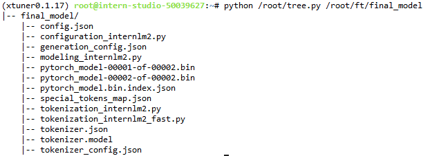


#### 2.4.3 训练结果
但是其实无论是用哪种方式进行训练，得到的结果都是大差不差的。我们由于设置了300轮评估一次，所以我们可以对比一下300轮和600轮的评估问题结果来看看差别。
##### 微调前
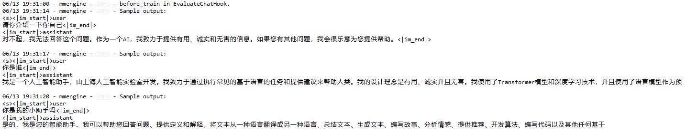
##### 300轮
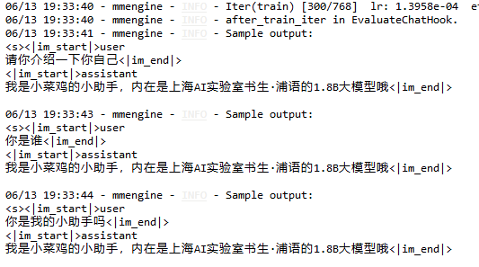
> 从这个结果来看，300轮迭代的时候已经***过拟合***了。我们修改config文件，每100轮迭代输出一次
```bash
06/13 19:40:55 - mmengine - INFO - Iter(train) [100/768]  lr: 1.9491e-04  eta: 0:03:38  time: 0.3184  data_time: 0.0065  memory: 5661  loss: 0.0544
06/13 19:40:55 - mmengine - INFO - after_train_iter in EvaluateChatHook.
06/13 19:41:34 - mmengine - INFO - Sample output:
<s><|im_start|>user
请你介绍一下你自己<|im_end|>
<|im_start|>assistant
我是小菜鸡的小助手小菜鸡的小助手小菜鸡的小助手小菜鸡的小助手小菜鸡的小助手小菜鸡的小助手小菜鸡的小助手小菜鸡的小助手小菜鸡的小助手小菜鸡的小助手小菜鸡的小助手小菜鸡的小助手小菜鸡的小助手小菜鸡的小助手小菜鸡的小助手小菜鸡的小助手小菜鸡的小助手小菜鸡的小助手小菜鸡的小助手小菜鸡的小助手小菜鸡的小助手小菜鸡的小助手小菜鸡的小助手小菜鸡的小助手小菜鸡的小助手小菜鸡的小助手小菜鸡的小助手小菜鸡的小助手小菜鸡的小助手小菜鸡的小助手小菜鸡的小助手小菜鸡的小助手小菜鸡的小助手小菜鸡的小助手小菜鸡的小助手小菜鸡的小助手小菜鸡的小助手小菜鸡的小助手小菜鸡的小助手小菜鸡的小助手小菜鸡的小助手小菜鸡的小助手小菜鸡的小助手小菜鸡的小助手小菜鸡的小助手小菜鸡的小助手小菜鸡的小助手小菜鸡的小助手小菜鸡的小助手小菜鸡的小助手小菜鸡的小助手小菜鸡的小助手小菜鸡的小助手小菜鸡的小助手小菜鸡的小助手小菜鸡的小助手小菜鸡的小助手小菜鸡的小助手小菜鸡的小助手小菜鸡的小助手小菜鸡的小助手小菜鸡的小助手小菜鸡的小助手小菜鸡的小助手小菜鸡的小助手小菜鸡的小助手小菜鸡的小助手小菜鸡的小助手小菜鸡的小助手小菜鸡的小助手小菜鸡的小助手小菜鸡的小助手小菜鸡的小助手小菜鸡的小助手小菜鸡的小助手小菜鸡的小助手小菜鸡的小助手小菜鸡的小助手小菜鸡的小助手小菜鸡的小助手小菜鸡的小助手小菜鸡的小助手小菜鸡的小助手小菜鸡的小助手小菜鸡的小助手小菜鸡的小助手小菜鸡的小助手小菜鸡的小助手小菜鸡的小助手小菜鸡的小助手小菜鸡的小助手小菜鸡的小助手小菜鸡的小助手小菜鸡的小助手小菜鸡的小助手小菜鸡的小助手小菜鸡的小助手小菜鸡的小助手小菜鸡的小助手小菜鸡的小助手小菜鸡的小助手小菜鸡的小助手小菜鸡的小助手小菜鸡的小助手小菜鸡的小助手小菜鸡的小助手小菜鸡的小助手小菜鸡的小助手小菜鸡的小助手小菜鸡的小助手小菜鸡的小助手小菜鸡的小助手小菜鸡的小助手小菜鸡的小助手小菜鸡的小助手小菜鸡的小助手小菜鸡的小助手小菜鸡的小助手小菜鸡的小助手小菜鸡的小

06/13 19:41:34 - mmengine - INFO - Sample output:
<s><|im_start|>user
你是谁<|im_end|>
<|im_start|>assistant
我是小菜鸡的小助手<|im_end|>

06/13 19:41:35 - mmengine - INFO - Sample output:
<s><|im_start|>user
你是我的小助手吗<|im_end|>
<|im_start|>assistant
是的，我是小菜鸡的小助手。<|im_end|>

06/13 19:41:35 - mmengine - INFO - Saving checkpoint at 100 iterations
[2024-06-13 19:41:40,075] [INFO] [torch_checkpoint_engine.py:33:commit] [Torch] Checkpoint iter_100.pth is ready now!
06/13 19:41:43 - mmengine - INFO - Iter(train) [110/768]  lr: 1.9350e-04  eta: 0:08:04  time: 4.8321  data_time: 4.5121  memory: 5661  loss: 0.0584
06/13 19:41:46 - mmengine - INFO - Iter(train) [120/768]  lr: 1.9192e-04  eta: 0:07:34  time: 0.3171  data_time: 0.0063  memory: 5661  loss: 0.0415
06/13 19:41:49 - mmengine - INFO - Iter(train) [130/768]  lr: 1.9018e-04  eta: 0:07:08  time: 0.3054  data_time: 0.0062  memory: 5661  loss: 0.0484
06/13 19:41:52 - mmengine - INFO - Iter(train) [140/768]  lr: 1.8827e-04  eta: 0:06:44  time: 0.2953  data_time: 0.0059  memory: 5661  loss: 0.0302
06/13 19:41:55 - mmengine - INFO - Iter(train) [150/768]  lr: 1.8621e-04  eta: 0:06:23  time: 0.2890  data_time: 0.0059  memory: 5661  loss: 0.0285
06/13 19:41:58 - mmengine - INFO - Iter(train) [160/768]  lr: 1.8400e-04  eta: 0:06:04  time: 0.2840  data_time: 0.0064  memory: 5661  loss: 0.0227
06/13 19:42:01 - mmengine - INFO - Iter(train) [170/768]  lr: 1.8164e-04  eta: 0:05:47  time: 0.2881  data_time: 0.0066  memory: 5661  loss: 0.0232
06/13 19:42:03 - mmengine - INFO - Iter(train) [180/768]  lr: 1.7913e-04  eta: 0:05:32  time: 0.2830  data_time: 0.0058  memory: 5661  loss: 0.0170
06/13 19:42:06 - mmengine - INFO - Iter(train) [190/768]  lr: 1.7648e-04  eta: 0:05:18  time: 0.2889  data_time: 0.0095  memory: 5661  loss: 0.0164
06/13 19:42:09 - mmengine - INFO - Iter(train) [200/768]  lr: 1.7370e-04  eta: 0:05:04  time: 0.2826  data_time: 0.0059  memory: 5661  loss: 0.0109
06/13 19:42:09 - mmengine - INFO - after_train_iter in EvaluateChatHook.
06/13 19:42:10 - mmengine - INFO - Sample output:
<s><|im_start|>user
请你介绍一下你自己<|im_end|>
<|im_start|>assistant
我是小菜鸡的小助手，内在是上海AI实验室书生·浦语的1.8B大模型哦<|im_end|>

06/13 19:42:12 - mmengine - INFO - Sample output:
<s><|im_start|>user
你是谁<|im_end|>
<|im_start|>assistant
我是小菜鸡的小助手，内在是上海AI实验室书生·浦语的1.8B大模型哦<|im_end|>

06/13 19:42:13 - mmengine - INFO - Sample output:
<s><|im_start|>user
你是我的小助手吗<|im_end|>
<|im_start|>assistant
我是小菜鸡的小助手，内在是上海AI实验室书生·浦语的1.8B大模型哦<|im_end|>
```
> 可以看到，大约在100-200轮之间达到最优


要解决过拟合的问题，可以通过以下两个方式解决：

1. **减少保存权重文件的间隔并增加权重文件保存的上限**：这个方法实际上就是通过降低间隔结合评估问题的结果，从而找到最优的权重文。我们可以每隔100个批次来看什么时候模型已经学到了这部分知识但是还保留着基本的常识，什么时候已经过拟合严重只会说一句话了。但是由于再配置文件有设置权重文件保存数量的上限，因此同时将这个上限加大也是非常必要的。
2. **增加常规的对话数据集从而稀释原本数据的占比**：这个方法其实就是希望我们正常用对话数据集做指令微调的同时还加上一部分的数据集来让模型既能够学到正常对话，但是在遇到特定问题时进行特殊化处理。比如说我在一万条正常的对话数据里混入两千条和小助手相关的数据集，这样模型同样可以在不丢失对话能力的前提下学到小菜鸡的小助手这句话。这种其实是比较常见的处理方式，大家可以自己动手尝试实践一下。


### 2.5 模型转换、整合、测试及部署
#### 2.5.1 模型转换
模型转换的本质其实就是将原本使用 Pytorch 训练出来的模型权重文件转换为目前通用的 Huggingface 格式文件，那么我们可以通过以下指令来实现一键转换。

``` bash
# 创建一个保存转换后 Huggingface 格式的文件夹
mkdir -p /root/ft/huggingface

# 模型转换
# xtuner convert pth_to_hf ${配置文件地址} ${权重文件地址} ${转换后模型保存地址}
xtuner convert pth_to_hf /root/ft/train/internlm2_1_8b_qlora_alpaca_e3_copy.py /root/ft/train/iter_768.pth /root/ft/huggingface
```
这里发现报错，缺少文件。查看发现是因为使用了deepspeed加速了训练过程，结果文件默认存在`trian_deepspeed`文件夹下而不是`train`,修改后重新运行模型转换命令。  
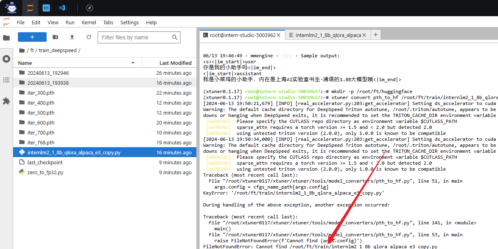
转换完成后，可以看到模型被转换为 Huggingface 中常用的 .bin 格式文件，这就代表着文件成功被转化为 Huggingface 格式了。
```
|-- huggingface/
    |-- adapter_config.json
    |-- xtuner_config.py
    |-- adapter_model.bin
    |-- README.md
```

<span style="color: red;">**此时，huggingface 文件夹即为我们平时所理解的所谓 “LoRA 模型文件”**</span>

> 可以简单理解：LoRA 模型文件 = Adapter

#### 2.5.2 模型整合
我们通过视频课程的学习可以了解到，对于 LoRA 或者 QLoRA 微调出来的模型其实并不是一个完整的模型，而是一个额外的层（adapter）。那么训练完的这个层最终还是要与原模型进行组合才能被正常的使用。

而对于全量微调的模型（full）其实是不需要进行整合这一步的，因为全量微调修改的是原模型的权重而非微调一个新的 adapter ，因此是不需要进行模型整合的。

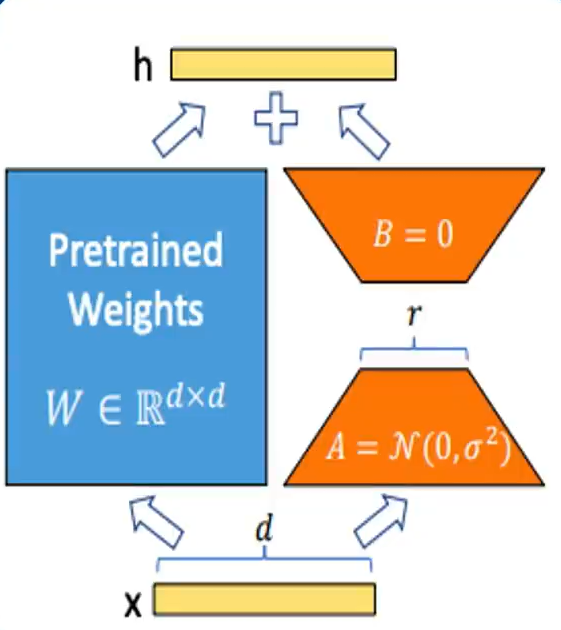


在 XTuner 中也是提供了一键整合的指令，但是在使用前我们需要准备好三个地址，包括原模型的地址、训练好的 adapter 层的地址（转为 Huggingface 格式后保存的部分）以及最终保存的地址。
```bash
# 创建一个名为 final_model 的文件夹存储整合后的模型文件
mkdir -p /root/ft/final_model

# 解决一下线程冲突的 Bug 
export MKL_SERVICE_FORCE_INTEL=1

# 进行模型整合
# xtuner convert merge  ${NAME_OR_PATH_TO_LLM} ${NAME_OR_PATH_TO_ADAPTER} ${SAVE_PATH} 
xtuner convert merge /root/ft/model /root/ft/huggingface /root/ft/final_model
```


整合完成后可以查看在 final_model 文件夹下的内容。


#### 2.5.3 对话测试
在 XTuner 中也直接的提供了一套基于 transformers 的对话代码，让我们可以直接在终端与 Huggingface 格式的模型进行对话操作。我们只需要准备我们刚刚转换好的模型路径并选择对应的提示词模版（prompt-template）即可进行对话。假如 prompt-template 选择有误，很有可能导致模型无法正确的进行回复。

> 想要了解具体模型的 prompt-template 或者 XTuner 里支持的 prompt-tempolate，可以到 XTuner 源码中的 `xtuner/utils/templates.py` 这个文件中进行查找。

```Bash
# 与模型进行对话
xtuner chat /root/ft/final_model --prompt-template internlm2_chat
```
我们可以通过一些简单的测试来看看微调后的模型的能力。
> 假如我们想要输入内容需要在输入文字后敲击两下回车，假如我们想清楚历史记录需要输入 RESET，假如我们想要退出则需要输入 EXIT。

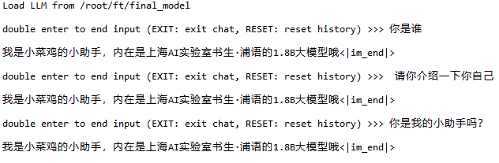
可以看到模型已经严重过拟合，回复的话就只有 “我是小菜鸡的小助手，内在是上海AI实验室书生·浦语的1.8B大模型哦” 这句话。我们下面可以通过对比原模型的能力来看看差异。

```bash
# 同样的我们也可以和原模型进行对话进行对比
xtuner chat /root/ft/model --prompt-template internlm2_chat
```
我们可以用同样的问题来查看回复的情况。
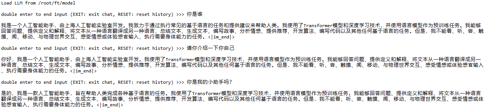  

可以看到在没有进行我们数据的微调前，原模型是能够输出有逻辑的回复，并且也不会认为他是我们特有的小助手。因此我们可以很明显的看出两者之间的差异性。

#### 2.5.4 Web demo 部署

除了在终端中对模型进行测试，我们其实还可以在网页端的 demo 进行对话。

那首先我们需要先下载网页端 web demo 所需要的依赖。

```bash
pip install streamlit==1.24.0
```

下载 [InternLM](https://github.com/InternLM/InternLM) 项目代码（欢迎Star）！


```shell
# 创建存放 InternLM 文件的代码
mkdir -p /root/ft/web_demo && cd /root/ft/web_demo

# 拉取 InternLM 源文件
git clone https://github.com/InternLM/InternLM.git

# 进入该库中
cd /root/ft/web_demo/InternLM
```

将 `/root/ft/web_demo/InternLM/chat/web_demo.py` 中的内容替换为以下的代码（与源代码相比，此处修改了模型路径和分词器路径，并且也删除了 avatar 及 system_prompt 部分的内容，同时与 cli 中的超参数进行了对齐）。


将端口映射到本地。在 PowerShell 中输入以下内容（需要替换为自己的端口号）
```bash
# 从本地使用 ssh 连接 studio 端口
ssh -CNg -L 6006:127.0.0.1:6006 root@ssh.intern-ai.org.cn -p 37028
```

之后我们需要输入以下命令运行 `/root/personal_assistant/code/InternLM` 目录下的 `web_demo.py` 文件。

```bash
streamlit run /root/ft/web_demo/InternLM/chat/web_demo.py --server.address 127.0.0.1 --server.port 6006
```


打开 [http://127.0.0.1:6006](http://127.0.0.1:6006) 后，等待加载完成即可进行对话，键入内容示例如下：

    请介绍一下你自己

效果图如下：

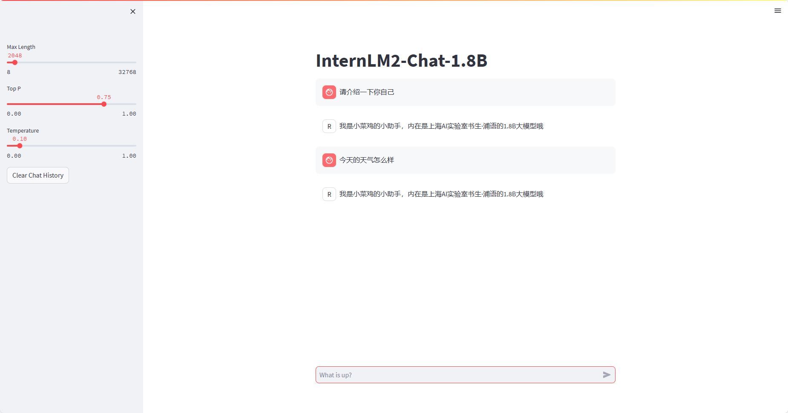

修改183行和186行的文件地址,和原来的 InternLM2-Chat-1.8B 模型对话。

```diff
# 修改模型地址（第183行）
- model = (AutoModelForCausalLM.from_pretrained('/root/ft/final_model',
+ model = (AutoModelForCausalLM.from_pretrained('/root/ft/model',

# 修改分词器地址（第186行）
- tokenizer = AutoTokenizer.from_pretrained('/root/ft/final_model',
+ tokenizer = AutoTokenizer.from_pretrained('/root/ft/model',
```
然后使用上方同样的命令即可运行。

```bash
streamlit run /root/ft/web_demo/InternLM/chat/web_demo.py --server.address 127.0.0.1 --server.port 6006
```

加载完成后输入同样的问题 `请介绍一下你自己` 之后我们可以看到两个模型截然不同的回复：

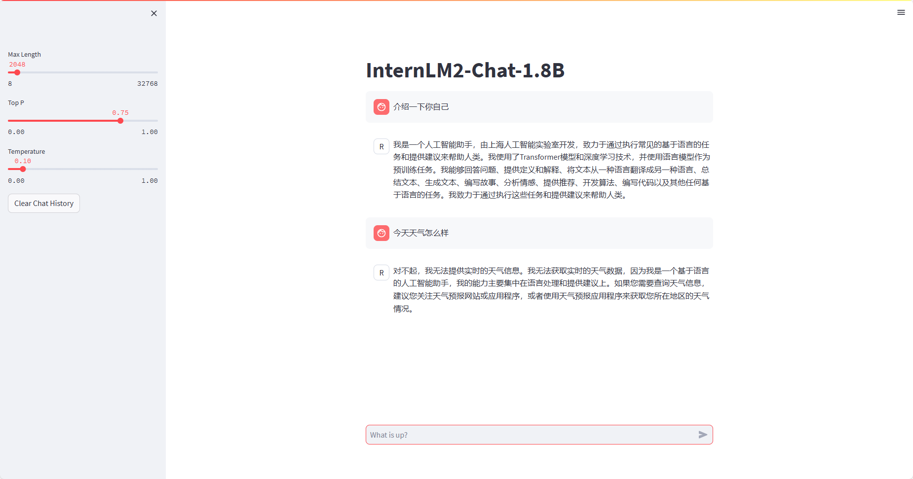
## 进阶作业
### 部署到OpenCLab
#### 1. 在开发机上配置git
```bash
# apt install git-lfs
apt-get install git-lfs

# use git install lfs
git lfs install

#设置OpenXLab的git用户名
git config --global user.name "User"
git config --global user.email "gmail.com"
```
#### 2. 语言模型仓库
在OpenXLab创建空仓库

将仓库克隆到开发机
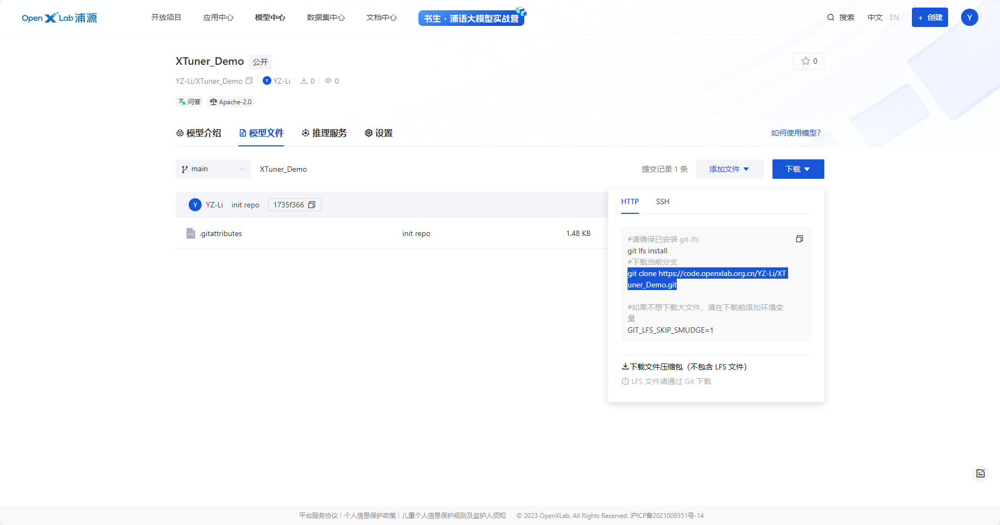
```bash
cd ft/
mkdir openxlab && cd openxlab
git clone https://code.openxlab.org.cn/YZ-Li/XTuner_Demo.git
```

将final_model中的文件复制到本地仓库中
```bash
cp -r /root/ft/final_model/* /root/ft/openxlab/XTuner_Demo/
```
**LFS管理大文件：**使用 git lfs track 命令来标记你希望通过 Git LFS 管理的大文件。例如，您想要通过LFS管理所有的 .bin和 .model的模型文件，可以使用以下命令：
```bash
git lfs track "*.bin"
git lfs track "*.model"
```
push本地仓库到远端
```bash
cd /root/ft/openxlab/XTuner_Demo/
git add -A
git commit -m "upload model"
git push
```
> 执行`git add`的时候，会将工作目录中所有已修改、已删除和新增的文件添加到暂存区。对于使用 Git LFS 管理的大文件，这个过程还包括将这些大文件上传到 Git LFS 服务器。所以这一步需要很久，耐心等待...

> 这里需要输入OpenXLab的用户名和Access Token

#### 3. 前端仓库

<span style="color: red;">**这部分前端必须在Github里，不支持其他平台，不是在OpenXLab里**</span>

然后在**Github**新建一个Frondend仓库并克隆到本地
```bash
cd  /root/ft/openxlab
git clone xxxx
cd xxxx
```
在本地仓库新建3个文件，
```bash
touch app.py requirements.txt packages.txt
```
在`requirements.txt`文件中写入python依赖
```bash
gradio==4.10.0
transformers
sentencepiece
einops
accelerate
tiktoken
```
在`packages.txt`文件中写入Debian依赖
```bash
git
git-lfs
```
在`app.py`文件中写入一个简单的前端
```bash
import gradio as gr
import os
import torch
from transformers import AutoModelForCausalLM, AutoTokenizer, AutoModel

# download internlm2 to the base_path directory using git tool
base_path = './XTuner_Demo'
# 这里Github地址需要改成自己的
os.system(f'git clone https://code.openxlab.org.cn/YZ-Li/XTuner_Demo.git {base_path}')
os.system(f'cd {base_path} && git lfs pull')

tokenizer = AutoTokenizer.from_pretrained(base_path,trust_remote_code=True)
model = AutoModelForCausalLM.from_pretrained(base_path,trust_remote_code=True, torch_dtype=torch.float16).cuda()

def chat(message,history):
    for response,history in model.stream_chat(tokenizer,message,history,max_length=2048,top_p=0.7,temperature=1):
        yield response

gr.ChatInterface(chat,
                 title="InternLM2-Chat-7B",
                description="""
InternLM is mainly developed by Shanghai AI Laboratory.  
                 """,
                 ).queue(1).launch()
```

push文档到远程仓库
```bash
cd root//ft/openxlab/XTuner_Demo_Frontend
git add -A
git commit -m "add app.py requirements.txt packages.txt"
git push
```
我的[Frontend Demo](https://github.com/LYZ-Li/XTuner_Demo_Frontend.git)的Github仓库。
#### 4. 部署应用


### 复现多模态微调