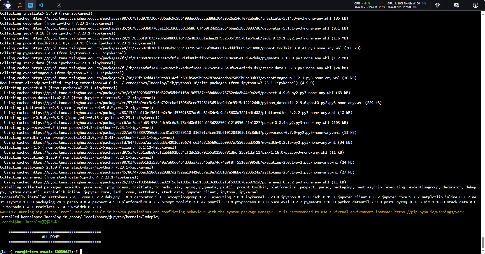

# 1. 配置环境
```bash
studio-conda -t lmdeploy -o pytorch-2.1.2
```

```bash
conda activate lmdeploy
pip install lmdeploy[all]==0.3.0
ls /root/share/new_models/Shanghai_AI_Laboratory/
cd ~
ln -s /root/share/new_models/Shanghai_AI_Laboratory/internlm2-chat-1_8b /root/
ls
```


```bash
touch /root/pipeline_transformer.py

```

将这些代码[pipeline_transformer.py](codes_05/pipeline_transformer.py)复制到文件中

```bash
conda activate lmdeploy
python /root/pipeline_transformer.py
```


# 2. 使用LMDeploy与模型对话
```bash
lmdeploy chat /root/internlm2-chat-1_8b
```

输入“请给我讲一个小故事吧”，然后按两下回车键。


```bash
lmdeploy chat -h
```
| 参数                      | 说明 |
|---------------------------|------|
| `model_path`              | 模型路径，可以是以下几种选项之一：<br> i) 本地目录路径，该路径包含由 `lmdeploy convert` 命令转换的模型或从 Huggingface 下载的模型。<br> ii) Huggingface 仓库中的量化模型 ID，例如 "internlm/internlm-chat-20b-4bit"。<br> iii) Huggingface 仓库中的模型 ID，例如 "internlm/internlm-chat-7b"。 |
| `--backend`               | 设置推理引擎。默认值：turbomind。 |
| `--trust-remote-code`     | 信任远程代码以加载 Huggingface 模型。默认值：True。 |
| `--meta-instruction`      | ChatTemplateConfig 的系统提示。已废弃，请使用 `--chat-template`。默认值：None。 |
| `--cap`                   | 模型的能力。已废弃，请使用 `--chat-template`。默认值：chat。 |
| `--adapters`              | 用于设置 lora 适配器的路径。可以输入 xxx=yyy 格式的键值对以支持多个适配器。如果只有一个适配器，可以仅输入适配器的路径。默认值：None。 |
| `--tp`                    | 张量并行中使用的 GPU 数量。应为 2 的幂。默认值：1。 |
| `--model-name`            | 待部署模型的名称，例如 llama-7b、llama-13b、vicuna-7b 等。可以运行 `lmdeploy list` 获取支持的模型名称。默认值：None。 |
| `--session-len`           | 序列的最大会话长度。默认值：None。 |
| `--max-batch-size`        | 最大批处理大小。默认值：128。 |
| `--cache-max-entry-count` | k/v 缓存占用的 GPU 内存百分比。默认值：0.8。 |
| `--model-format`          | 输入模型的格式。`hf` 表示 `hf_llama`，`llama` 表示 `meta_llama`，`awq` 表示由 awq 量化的模型。默认值：None。 |
| `--quant-policy`          | 是否使用 kv int8。默认值：0。 |
| `--rope-scaling-factor`   | Rope 缩放因子。默认值：0.0。 |

# 3. LMDeploy模型量化(lite)

## 3.1 设置最大KV Cache缓存大小
首先保持不加该参数（默认0.8），运行1.8B模型。
```bash
lmdeploy chat /root/internlm2-chat-1_8b
```

> 此时**24G**显存几乎全部占满

  
改变--cache-max-entry-count参数，设为0.4。
```bash
lmdeploy chat /root/internlm2-chat-1_8b --cache-max-entry-count 0.4
```
> 此时只占用了约**6G**显存


## 3.2 使用W4A16量化
```bash
pip install einops==0.7.0
```
```bash
lmdeploy lite auto_awq \
   /root/internlm2-chat-1_8b \
  --calib-dataset 'ptb' \
  --calib-samples 128 \
  --calib-seqlen 1024 \
  --w-bits 4 \
  --w-group-size 128 \
  --work-dir /root/internlm2-chat-1_8b-4bit

```
设置KV Cache最大占用比例为0.4
```bash
lmdeploy chat /root/internlm2-chat-1_8b-4bit --model-format awq --cache-max-entry-count 0.4
```


**拓展内容**：有关LMDeploy的lite功能的更多参数可通过-h命令查看。

```sh
lmdeploy lite -h
```
| 命令组                  | 说明 |
|-------------------------|------|
| `auto_awq`              | 使用 AWQ 算法进行权重量化。 |
| `calibrate`             | 在给定数据集上进行校准。 |
| `kv_qparams`            | 导出键和值的统计信息。 |
| `smooth_quant`          | 使用 SmoothQuant 进行 w8a8 量化。 |

# 4.LMDeploy服务(serve)

## 4.1 启动API服务器
```sh
lmdeploy serve api_server \
    /root/internlm2-chat-1_8b \
    --model-format hf \
    --quant-policy 0 \
    --server-name 0.0.0.0 \
    --server-port 23333 \
    --tp 1
```


映射本地端口到Server，查看API
```sh
ssh -CNg -L 23333:127.0.0.1:23333 root@ssh.intern-ai.org.cn -p 37405
```


打开浏览器，访问`http://127.0.0.1:23333`。

## 4.2 命令行客户端连接API服务器
```sh
conda activate lmdeploy
lmdeploy serve api_client http://localhost:23333
```


目前的架构为  


## 4.3 网页客户端连接API服务器
使用Gradio作为前端，启动网页客户端。

```sh
lmdeploy serve gradio http://localhost:23333 \
    --server-name 0.0.0.0 \
    --server-port 6006
```


此时的架构为  


运行命令后，网页客户端启动。在电脑本地新建一个cmd终端，新开一个转发端口：

```sh
ssh -CNg -L 6006:127.0.0.1:6006 root@ssh.intern-ai.org.cn -p 37405
```

打开浏览器，访问地址`http://127.0.0.1:6006`


然后就可以与模型进行对话了！

# 5.Python代码集成

## 5.1 Python代码集成运行1.8B模型
新建Python源代码文件`pipeline.py`。

```sh
touch /root/pipeline.py
```

打开`pipeline.py`，填入以下内容。

```py
from lmdeploy import pipeline

pipe = pipeline('/root/internlm2-chat-1_8b')
response = pipe(['Hi, pls intro yourself', '上海是'])
print(response)
```

保存后运行代码文件：

```sh
python /root/pipeline.py
```


## 5.2 向TurboMind后端传递参数

在第3章，我们通过向lmdeploy传递附加参数，实现模型的量化推理，及设置KV Cache最大占用比例。在Python代码中，可以通过创建TurbomindEngineConfig，向lmdeploy传递参数。

以设置KV Cache占用比例为例，新建python文件`pipeline_kv.py`。

```sh
touch /root/pipeline_kv.py
```

打开`pipeline_kv.py`，填入如下内容：

```py
from lmdeploy import pipeline, TurbomindEngineConfig

# 调低 k/v cache内存占比调整为总显存的 20%
backend_config = TurbomindEngineConfig(cache_max_entry_count=0.4)

pipe = pipeline('/root/internlm2-chat-1_8b',
                backend_config=backend_config)
response = pipe(['Hi, pls intro yourself', '上海是'])
print(response)
```

保存后运行python代码：

```sh
python /root/pipeline_kv.py
```

得到输出结果：


# 6. 使用LMDeploy运行视觉多模态大模型llava

<span style="color: red;">最低需要30% A100 (24G)显存</span>

## 6.1 加载大模型
首先激活conda环境。

```sh
conda activate lmdeploy
```

安装llava依赖库。

```sh
pip install git+https://github.com/haotian-liu/LLaVA.git@4e2277a060da264c4f21b364c867cc622c945874
```

新建`pipeline_llava.py`。

```sh
touch /root/pipeline_llava.py
```

打开`pipeline_llava.py`，填入内容如下：

```py
from lmdeploy.vl import load_image
from lmdeploy import pipeline, TurbomindEngineConfig


backend_config = TurbomindEngineConfig(session_len=8192) # 图片分辨率较高时请调高session_len
# pipe = pipeline('liuhaotian/llava-v1.6-vicuna-7b', backend_config=backend_config) 非开发机运行此命令
pipe = pipeline('/share/new_models/liuhaotian/llava-v1.6-vicuna-7b', backend_config=backend_config)

image = load_image('https://raw.githubusercontent.com/open-mmlab/mmdeploy/main/tests/data/tiger.jpeg')
response = pipe(('describe this image', image))
print(response)
```

> **代码解读**： \
> * 第1行引入用于载入图片的load_image函数，第2行引入了lmdeploy的pipeline模块， \
> * 第5行创建了pipeline实例 \
> * 第7行从github下载了一张关于老虎的图片，如下： \
>  \
> * 第8行运行pipeline，输入提示词“describe this image”，和图片，结果返回至response \
> * 第9行输出response

保存后运行pipeline。

```sh
python /root/pipeline_llava.py
```

得到输出结果：


## 6.2 使用网页客户端
新建python文件`gradio_llava.py`。

```sh
touch /root/gradio_llava.py
```

打开文件，填入以下内容：

```py
import gradio as gr
from lmdeploy import pipeline, TurbomindEngineConfig


backend_config = TurbomindEngineConfig(session_len=8192) # 图片分辨率较高时请调高session_len
# pipe = pipeline('liuhaotian/llava-v1.6-vicuna-7b', backend_config=backend_config) 非开发机运行此命令
pipe = pipeline('/share/new_models/liuhaotian/llava-v1.6-vicuna-7b', backend_config=backend_config)

def model(image, text):
    if image is None:
        return [(text, "请上传一张图片。")]
    else:
        response = pipe((text, image)).text
        return [(text, response)]

demo = gr.Interface(fn=model, inputs=[gr.Image(type="pil"), gr.Textbox()], outputs=gr.Chatbot())
demo.launch()   
```

运行python程序。

```sh
python /root/gradio_llava.py
```

通过ssh转发一下7860端口。

```sh
ssh -CNg -L 7860:127.0.0.1:7860 root@ssh.intern-ai.org.cn -p 37405
```

通过浏览器访问`http://127.0.0.1:7860`。

然后就可以使用啦~


# 7. 定量比较LMDeploy与Transformer库的推理速度差异

为了直观感受LMDeploy与Transformer库推理速度的差异，编写一个速度测试脚本。测试环境是30%的InternStudio开发机。

先来测试一波Transformer库推理Internlm2-chat-1.8b的速度，新建python文件，命名为`benchmark_transformer.py`，填入以下内容：

```py
import torch
import datetime
from transformers import AutoTokenizer, AutoModelForCausalLM

tokenizer = AutoTokenizer.from_pretrained("/root/internlm2-chat-1_8b", trust_remote_code=True)

# Set `torch_dtype=torch.float16` to load model in float16, otherwise it will be loaded as float32 and cause OOM Error.
model = AutoModelForCausalLM.from_pretrained("/root/internlm2-chat-1_8b", torch_dtype=torch.float16, trust_remote_code=True).cuda()
model = model.eval()

# warmup
inp = "hello"
for i in range(5):
    print("Warm up...[{}/5]".format(i+1))
    response, history = model.chat(tokenizer, inp, history=[])

# test speed
inp = "请介绍一下你自己。"
times = 10
total_words = 0
start_time = datetime.datetime.now()
for i in range(times):
    response, history = model.chat(tokenizer, inp, history=history)
    total_words += len(response)
end_time = datetime.datetime.now()

delta_time = end_time - start_time
delta_time = delta_time.seconds + delta_time.microseconds / 1000000.0
speed = total_words / delta_time
print("Speed: {:.3f} words/s".format(speed))
```

运行python脚本：

```sh
python benchmark_transformer.py
```

得到运行结果：


可以看到，Transformer库的推理速度约为45.983 words/s，注意单位是words/s，不是token/s，word和token在数量上可以近似认为成线性关系。

下面来测试一下LMDeploy的推理速度，新建python文件`benchmark_lmdeploy.py`，填入以下内容：

```py
import datetime
from lmdeploy import pipeline

pipe = pipeline('/root/internlm2-chat-1_8b')

# warmup
inp = "hello"
for i in range(5):
    print("Warm up...[{}/5]".format(i+1))
    response = pipe([inp])

# test speed
inp = "请介绍一下你自己。"
times = 10
total_words = 0
start_time = datetime.datetime.now()
for i in range(times):
    response = pipe([inp])
    total_words += len(response[0].text)
end_time = datetime.datetime.now()

delta_time = end_time - start_time
delta_time = delta_time.seconds + delta_time.microseconds / 1000000.0
speed = total_words / delta_time
print("Speed: {:.3f} words/s".format(speed))
```

运行脚本：

```sh
python benchmark_lmdeploy.py
```

得到运行结果：


可以看到，LMDeploy的推理速度约为474.217 words/s，是Transformer库的10.5倍。  
<span style="color: red;">教程中指出，LMDeploy的推理速度约为Transformer库的6倍左右，原因是在Transformer库运行时，我打开了第二个Terminal编辑``的内容，这也侧边反映了制约推理速度的因素是**访写速度**</span>

# 8. 部署到OpenXLab

[Github](https://github.com/LYZ-Li/LMDeploy_Web_Demo)

[OpenXLab](https://openxlab.org.cn/apps/detail/YZ-Li/LYZ_LMDeploy_Web_Demo)