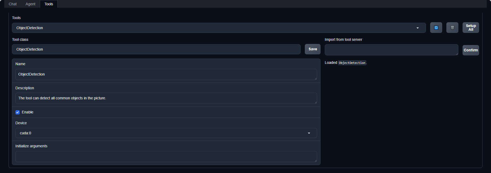
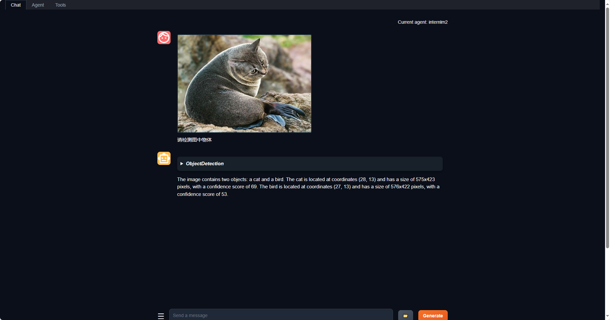

# 1. 环境配置

选择镜像为 Cuda12.2-conda，并选择 GPU 为30% A100
```bash
mkdir -p /root/agent
studio-conda -t agent -o pytorch-2.1.2
```

发现这里的环境要求与第五节课的LMDeploy一样，这里沿用lmdeploy环境
```bash
conda activate lmdeploy
```
接着安装**Lagent 和 AgentLego**
```bash
cd /root/agent
conda activate agent
git clone https://gitee.com/internlm/lagent.git
cd lagent && git checkout 581d9fb && pip install -e . && cd ..
git clone https://gitee.com/internlm/agentlego.git
cd agentlego && git checkout 7769e0d && pip install -e . && cd ..
```
准备
```sh
cd /root/agent
git clone -b camp2 https://gitee.com/internlm/Tutorial.git
```

# 2. Lagent：轻量级智能体框架
执行如下代码使用 LMDeploy 启动一个 api_server。

```bash
conda activate lmdeploy
lmdeploy serve api_server /root/share/new_models/Shanghai_AI_Laboratory/internlm2-chat-7b \
                            --server-name 127.0.0.1 \
                            --model-name internlm2-chat-7b \
                            --cache-max-entry-count 0.1
```


### 1.2 启动并使用 Lagent Web Demo

在新建的 terminal 中执行如下指令以启动 Lagent Web Demo：

```bash
conda activate lmdeploy
cd /root/agent/lagent/examples
streamlit run internlm2_agent_web_demo.py --server.address 127.0.0.1 --server.port 7860
```


在等待 LMDeploy 的 api_server 与 Lagent Web Demo 完全启动后（如下图所示），在**本地**进行端口映射，将 LMDeploy api_server 的23333端口以及 Lagent Web Demo 的7860端口映射到本地。可以执行：

```bash
ssh -CNg -L 7860:127.0.0.1:7860 -L 23333:127.0.0.1:23333 root@ssh.intern-ai.org.cn -p 37405
```

在本地的浏览器页面中打开 http://localhost:7860 以使用 Lagent Web Demo。首先输入模型 IP 为 127.0.0.1:23333，**在输入完成后按下回车键以确认**。并选择插件为 ArxivSearch，以让模型获得在 arxiv 上搜索论文的能力。


我们输入“请帮我搜索 InternLM2 Technical Report” 以让模型搜索书生·浦语2的技术报告。效果如下图所示，可以看到模型正确输出了 InternLM2 技术报告的相关信息。尽管还输出了其他论文，但这是由 arxiv 搜索 API 的相关行为导致的。


下面我们将实现一个调用和风天气 API 的工具以完成实时天气查询的功能。

### 2.1 创建工具文件

首先通过 `touch /root/agent/lagent/lagent/actions/weather.py`（大小写敏感）新建工具文件，文件内容见[weather.py](codes_06/weather.py)


### 2.2 获取 API KEY

为了获得稳定的天气查询服务，获取 https://dev.qweather.com/docs/api/ 提供的免费API。

### 2.3 体验自定义工具weather API

与 1.2 部分类似，我们在两个 terminal 中分别启动 LMDeploy 服务和 Tutorial 已经写好的用于这部分的 Web Demo：

> [!IMPORTANT]
> 注意，确保 1.1 节中的 LMDeploy 服务以及 1.2 节中的 Web Demo 服务已经停止（即 terminal 已关闭），否则会出现 CUDA Out of Memory 或是端口已占用的情况！

```bash
conda activate lmdeploy
lmdeploy serve api_server /root/share/new_models/Shanghai_AI_Laboratory/internlm2-chat-7b \
                            --server-name 127.0.0.1 \
                            --model-name internlm2-chat-7b \
                            --cache-max-entry-count 0.1
```

```bash
export WEATHER_API_KEY=f7eca9f7918b4735abea12e105934940
# 比如 export WEATHER_API_KEY=1234567890abcdef
conda activate lmdeploy
cd /root/agent/Tutorial/agent
streamlit run internlm2_weather_web_demo.py --server.address 127.0.0.1 --server.port 7860
```

并在**本地**执行如下操作以进行端口映射：

```bash
ssh -CNg -L 7860:127.0.0.1:7860 -L 23333:127.0.0.1:23333 root@ssh.intern-ai.org.cn -p 你的 ssh 端口号
```

在输入模型地址并选择好工具后，就可以开始体验了。下图是一个例子：


# 3. AgentLego：组装智能体“乐高”
## 3.1 直接使用 AgentLego

首先下载 demo 文件：

```bash
cd /root/agent
wget http://download.openmmlab.com/agentlego/road.jpg
```

AgentLego 所实现的目标检测工具是基于 mmdet (MMDetection) 算法库中的 RTMDet-Large 模型，因此我们首先安装 mim，然后通过 mim 工具来安装 mmdet。

```bash
conda activate lmdeploy
pip install openmim==0.3.9
mim install mmdet==3.3.0
```

新建 `touch /root/agent/direct_use.py`文档，内容direct_use.py 的如下：

```python
import re

import cv2
from agentlego.apis import load_tool

# load tool
tool = load_tool('ObjectDetection', device='cuda')

# apply tool
visualization = tool('/root/agent/road.jpg')
print(visualization)

# visualize
image = cv2.imread('/root/agent/road.jpg')

preds = visualization.split('\n')
pattern = r'(\w+) \((\d+), (\d+), (\d+), (\d+)\), score (\d+)'

for pred in preds:
    name, x1, y1, x2, y2, score = re.match(pattern, pred).groups()
    x1, y1, x2, y2, score = int(x1), int(y1), int(x2), int(y2), int(score)
    cv2.rectangle(image, (x1, y1), (x2, y2), (0, 255, 0), 1)
    cv2.putText(image, f'{name} {score}', (x1, y1), cv2.FONT_HERSHEY_SIMPLEX, 0.8, (0, 255, 0), 1)

cv2.imwrite('/root/agent/road_detection_direct.jpg', image)
```

此时文件树结构如下：  


接下来在执行 `python /root/agent/direct_use.py` 以进行推理。在等待 RTMDet-Large 权重下载并推理完成后，我们就可以看到如下输出以及一张位于 /root/agent 名为 road_detection_direct.jpg 的图片：

将图片从开发机下载到本地
```sh
scp -P 37405 root@ssh.intern-ai.org.cn:/root/agent/road_detection_direct.jpg C:\Users\xxxxx\Downloads

```
| 原图 | 结果 |
| --- | --- |
|  | |

## 3.2 作为智能体工具使用

### 3.2.1 修改相关文件

由于 AgentLego 算法库默认使用 InternLM2-Chat-20B 模型，因此我们首先需要修改 /root/agent/agentlego/webui/modules/agents/lagent_agent.py 文件的第 105行位置，将 internlm2-chat-20b 修改为 internlm2-chat-7b，即

```diff
def llm_internlm2_lmdeploy(cfg):
    url = cfg['url'].strip()
    llm = LMDeployClient(
-         model_name='internlm2-chat-20b',
+         model_name='internlm2-chat-7b',
        url=url,
        meta_template=INTERNLM2_META,
        top_p=0.8,
        top_k=100,
        temperature=cfg.get('temperature', 0.7),
        repetition_penalty=1.0,
        stop_words=['<|im_end|>'])
    return llm
```

其中红色表示要删除的内容，绿色表示要添加的内容。

### 3.2.2 使用 LMDeploy 部署

由于 AgentLego 的 WebUI 需要用到 LMDeploy 所启动的 api_server，因此我们首先按照下图指示在 vscode terminal 中执行如下代码使用 LMDeploy 启动一个 api_server。

```bash
conda activate lmdeploy
lmdeploy serve api_server /root/share/new_models/Shanghai_AI_Laboratory/internlm2-chat-7b \
                            --server-name 127.0.0.1 \
                            --model-name internlm2-chat-7b \
                            --cache-max-entry-count 0.1
```


### 3.2.3 启动 AgentLego WebUI

接下来我们按照下图指示新建一个 terminal 以启动 AgentLego WebUI。在新建的 terminal 中执行如下指令：

```bash
conda activate lmdeploy
cd /root/agent/agentlego/webui
pip install -U langchain-community
python one_click.py
```


在等待 LMDeploy 的 api_server 与 AgentLego WebUI 完全启动后（如下图所示），在**本地**进行端口映射，将 LMDeploy api_server 的23333端口以及 AgentLego WebUI 的7860端口映射到本地。可以执行：

```bash
ssh -CNg -L 7860:127.0.0.1:7860 -L 23333:127.0.0.1:23333 root@ssh.intern-ai.org.cn -p 37406
```

### 3.2.4 使用 AgentLego WebUI

接下来在本地的浏览器页面中打开 http://localhost:7860 以使用 AgentLego WebUI。首先来配置 Agent，如下图所示。

1. 点击上方 Agent 进入 Agent 配置页面。
2. 点击 Agent 下方框，选择 New Agent。
3. 选择 Agent Class 为 lagent.InternLM2Agent。
4. 输入模型 URL 为 http://127.0.0.1:23333 。
5. 输入 Agent name，自定义即可，图中输入了 internlm2。
6. 点击 save to 以保存配置，这样在下次使用时只需在第2步时选择 Agent 为 internlm2 后点击 load 以加载就可以了。
7. 点击 load 以加载配置。


然后配置工具，如下图所示。

1. 点击上方 Tools 页面进入工具配置页面。
2. 点击 Tools 下方框，选择 New Tool 以加载新工具。
3. 选择 Tool Class 为 ObjectDetection。
4. 点击 save 以保存配置。



等待工具加载完成后，点击上方 Chat 以进入对话页面。在页面下方选择工具部分只选择 ObjectDetection 工具，如下图所示。为了确保调用工具的成功率，请在使用时确保仅有这一个工具启用。


接下来就可以愉快地使用 Agent 了。点击右下角文件夹以上传图片，上传图片后输入指令并点击 generate 以得到模型回复。


## 3.3 用 AgentLego 自定义工具

在本节中，我们将基于 AgentLego 构建自己的自定义工具。AgentLego 在这方面提供了较为详尽的文档，文档地址为 https://agentlego.readthedocs.io/zh-cn/latest/modules/tool.html 。自定义工具主要分为以下几步：

1. 继承 BaseTool 类
2. 修改 default_desc 属性（工具功能描述）
3. 如有需要，重载 setup 方法（重型模块延迟加载）
4. 重载 apply 方法（工具功能实现）

其中第一二四步是必须的步骤。下面我们将实现一个调用 MagicMaker 的 API 以实现图像生成的工具。

MagicMaker 是汇聚了优秀 AI 算法成果的免费 AI 视觉素材生成与创作平台。主要提供图像生成、图像编辑和视频生成三大核心功能，全面满足用户在各种应用场景下的视觉素材创作需求。体验更多功能可以访问 https://magicmaker.openxlab.org.cn/home 。

### 3.3.1 创建工具文件

首先通过 `touch /root/agent/agentlego/agentlego/tools/magicmaker_image_generation.py`的方法新建工具文件。该文件的内容[magicmaker_image_generation.py](codes_06/magicmaker_image_generation.py)：


### 3.3.2 注册新工具

接下来修改 /root/agent/agentlego/agentlego/tools/\_\_init\_\_.py 文件，将我们的工具注册在工具列表中。如下所示，我们将 MagicMakerImageGeneration 通过 from .magicmaker_image_generation import MagicMakerImageGeneration 导入到了文件中，并且将其加入了 \_\_all\_\_ 列表中。

```diff
from .base import BaseTool
from .calculator import Calculator
from .func import make_tool
from .image_canny import CannyTextToImage, ImageToCanny
from .image_depth import DepthTextToImage, ImageToDepth
from .image_editing import ImageExpansion, ImageStylization, ObjectRemove, ObjectReplace
from .image_pose import HumanBodyPose, HumanFaceLandmark, PoseToImage
from .image_scribble import ImageToScribble, ScribbleTextToImage
from .image_text import ImageDescription, TextToImage
from .imagebind import AudioImageToImage, AudioTextToImage, AudioToImage, ThermalToImage
from .object_detection import ObjectDetection, TextToBbox
from .ocr import OCR
from .scholar import *  # noqa: F401, F403
from .search import BingSearch, GoogleSearch
from .segmentation import SegmentAnything, SegmentObject, SemanticSegmentation
from .speech_text import SpeechToText, TextToSpeech
from .translation import Translation
from .vqa import VQA
+ from .magicmaker_image_generation import MagicMakerImageGeneration

__all__ = [
    'CannyTextToImage', 'ImageToCanny', 'DepthTextToImage', 'ImageToDepth',
    'ImageExpansion', 'ObjectRemove', 'ObjectReplace', 'HumanFaceLandmark',
    'HumanBodyPose', 'PoseToImage', 'ImageToScribble', 'ScribbleTextToImage',
    'ImageDescription', 'TextToImage', 'VQA', 'ObjectDetection', 'TextToBbox', 'OCR',
    'SegmentObject', 'SegmentAnything', 'SemanticSegmentation', 'ImageStylization',
    'AudioToImage', 'ThermalToImage', 'AudioImageToImage', 'AudioTextToImage',
    'SpeechToText', 'TextToSpeech', 'Translation', 'GoogleSearch', 'Calculator',
-     'BaseTool', 'make_tool', 'BingSearch'
+     'BaseTool', 'make_tool', 'BingSearch', 'MagicMakerImageGeneration'
]
```

### 3.3.3 体验自定义工具效果

在两个 terminal 中分别启动 LMDeploy 服务和 AgentLego 的 WebUI 以体验我们自定义的工具的效果。

> [!IMPORTANT]
> 注意，确保 2.2 节中的 LMDeploy 服务以及 2.3 节中的 Web Demo 服务已经停止（即 terminal 已关闭），否则会出现 CUDA Out of Memory 或是端口已占用的情况！

```bash
conda activate lmdeploy
lmdeploy serve api_server /root/share/new_models/Shanghai_AI_Laboratory/internlm2-chat-7b \
                            --server-name 127.0.0.1 \
                            --model-name internlm2-chat-7b \
                            --cache-max-entry-count 0.1
```

```bash
conda activate lmdeploy
cd /root/agent/agentlego/webui
python one_click.py
```

并在**本地**执行如下操作以进行端口映射：

```bash
ssh -CNg -L 7860:127.0.0.1:7860 -L 23333:127.0.0.1:23333 root@ssh.intern-ai.org.cn -p 你的 ssh 端口号
```

在 Tool 界面选择 MagicMakerImageGeneration 后点击 save 后，回到 Chat 页面选择 MagicMakerImageGeneration 工具后就可以开始使用了。为了确保调用工具的成功率，请在使用时确保仅有这一个工具启用。下图是一个例子。可以看到模型成功地调用了工具并得到了结果。


# 