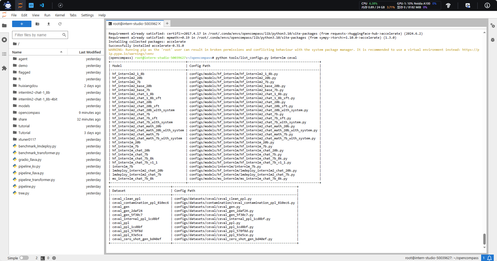
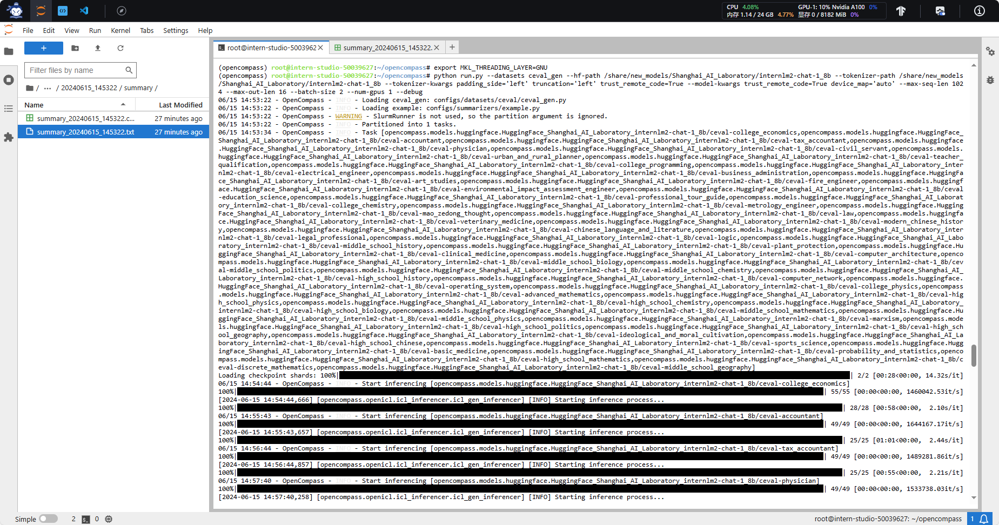
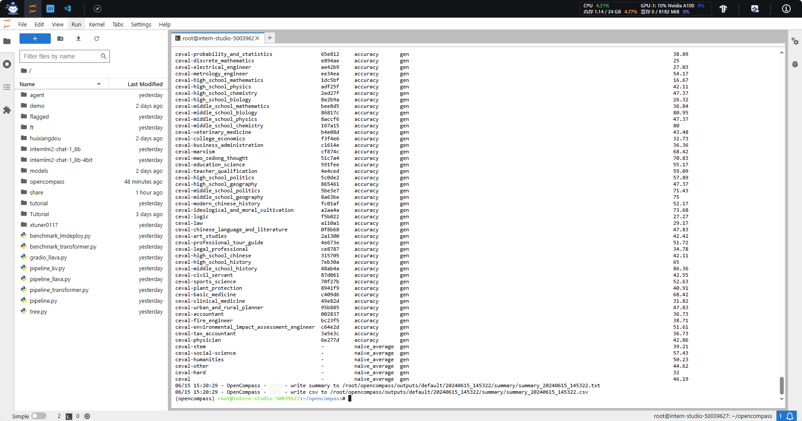
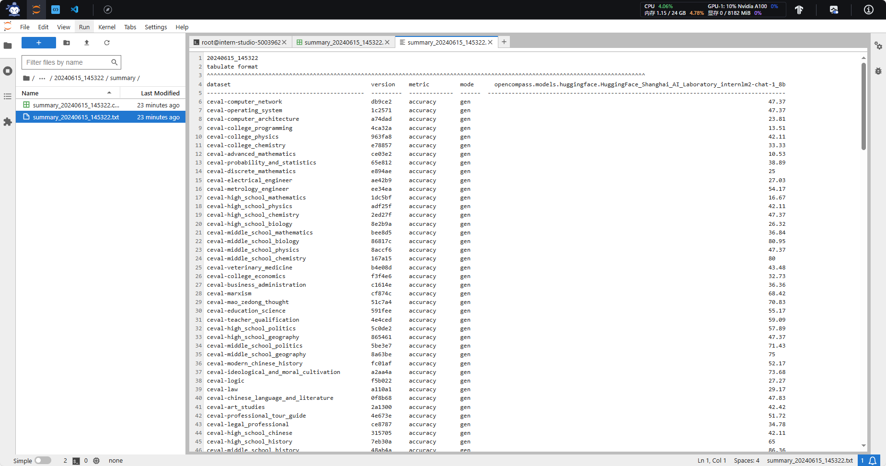
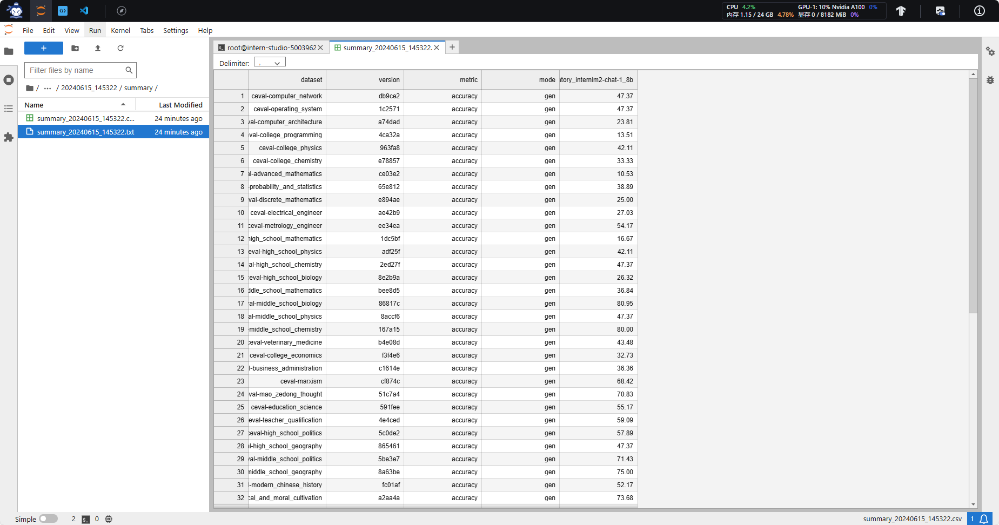

# 1 配置
## 1.1 环境配置
在创建开发机界面选择镜像为 Cuda11.7-conda，并选择 GPU 为10% A100。

安装环境
```shell
studio-conda -o internlm-base -t opencompass
source activate opencompass
git clone -b 0.2.4 https://github.com/open-compass/opencompass
cd opencompass
pip install -e .
```
**如果pip install -e .安装未成功,请运行:**
```shell
pip install -r requirements.txt
```
或者直接安装以下包
```sh
pip install tqdm
pip install prettytable
pip install tabulate
pip install mmengine
pip install datasets
pip install transformers
pip install jieba
pip install scikit-learn
pip install evaluate
pip install rouge_chinese
pip install nltk
pip install rank_bm25
pip install sentence_transformers
pip install tiktoken
pip install absl-py
pip install fuzzywuzzy
pip install python-Levenshtein
pip install sentencepiece
pip install protobuf
pip install einops
pip install accelerate
```
## 1.2 数据准备
解压评测数据集到 data/ 处
```shell
cp /share/temp/datasets/OpenCompassData-core-20231110.zip /root/opencompass/
unzip OpenCompassData-core-20231110.zip
```
将会在 OpenCompass 下看到data文件夹

列出所有跟 InternLM 及 C-Eval 相关的配置
```shell
python tools/list_configs.py internlm ceval
```
将会看到受支持的数据集和模型



# 2 启动评测 (10% A100 8GB 资源)
确保按照上述步骤正确安装 OpenCompass 并准备好数据集后，可以通过以下命令评测 InternLM2-Chat-1.8B 模型在 C-Eval 数据集上的性能。由于 OpenCompass 默认并行启动评估过程，我们可以在第一次运行时以 --debug 模式启动评估，并检查是否存在问题。在 --debug 模式下，任务将按顺序执行，并实时打印输出。
```shell
export MKL_SERVICE_FORCE_INTEL=1
#或
export MKL_THREADING_LAYER=GNU
python run.py --datasets ceval_gen --hf-path /share/new_models/Shanghai_AI_Laboratory/internlm2-chat-1_8b --tokenizer-path /share/new_models/Shanghai_AI_Laboratory/internlm2-chat-1_8b --tokenizer-kwargs padding_side='left' truncation='left' trust_remote_code=True --model-kwargs trust_remote_code=True device_map='auto' --max-seq-len 1024 --max-out-len 16 --batch-size 2 --num-gpus 1 --debug
```
命令解释：
| 参数 | 说明 |
| --- | --- |
| `--datasets ceval_gen` | 要评价的数据集 |
| `--hf-path /share/new_models/Shanghai_AI_Laboratory/internlm2-chat-1_8b` | 使用的模型 |
| `--tokenizer-path /share/new_models/Shanghai_AI_Laboratory/internlm2-chat-1_8b` | 分词器（tokenizer）的路径 |
| `--tokenizer-kwargs padding_side='left' truncation='left'` | 额外的参数给分词器。`padding_side='left'`意味着在序列的左侧填充标记，以确保所有序列的长度一致。`truncation='left'`表示如果序列超过了最大长度，将从左侧开始截断。 |
| `trust_remote_code=True` | 这个布尔参数允许加载远程代码，这在加载模型和分词器时可能会用到。设置为True意味着信任并加载远程代码。 |
| `device_map='auto'` | 这个参数指定了模型应该在哪个设备上运行。`'auto'`选项意味着让系统自动决定使用哪个设备，通常是GPU（如果有的话）。 |
| `--max-seq-len 1024` | 可以输入的最大序列长度 1024 token/字符 |
| `--max-out-len 16` | 可以输出的最大序列长度 16 token/字符（视情况而定） |
| `--batch-size 2` | 每小批次训练处理的样本数 |
| `--num-gpus 1` | GPU数 |
| `--work dir ‘xxxx/xxx’` | 指定执行操作的路径，默认在outputs/default路径下 |
| `--reuse latest` | 指定从哪个时间戳开始跑，时间戳查看在outputs/default,比如`--reuse 20240416_215103`,就是接着这个时间戳开始跑 |
| `--debug` | 开这个模式，所有的bug都会在terminal显示，不开就在outputs/logs下 |


如果一切正常，您应该看到屏幕上显示 “Starting inference process”：

评测完成后，将会看到：


测试结果保存在路径`/root/opencompass/outputs/default/<时间戳>/summary/`下，有csv和txt两个文件可以查看




# 3 自定义数据集客主观评测：量身定制，慧眼识珠

## 3.1 自建客观数据集步骤
详细的客观评测指引参见
https://opencompass.readthedocs.io/zh-cn/latest/advanced_guides/new_dataset.html


## 3.2 自建主观数据集步骤
详细的主观评测指引参见
https://opencompass.readthedocs.io/zh-cn/latest/advanced_guides/subjective_evaluation.html

# 4 数据污染评估：禁止作弊，诚信考试
## 4.1  数据污染评估简介
数据污染 是指本应用在下游测试任务中的数据出现在了大语言模型 (LLM) 的训练数据中，从而导致在下游任务 (例如，摘要、自然语言推理、文本分类) 上指标虚高，无法反映模型真实泛化能力的现象。
由于数据污染的源头是出现在 LLM 所用的训练数据中，因此最直接的检测数据污染的方法就是将测试数据与训练数据进行碰撞，然后汇报两者之间有多少语料是重叠出现的，经典的 GPT-3 论文中的表 C.1 会报告了相关内容。
但如今开源社区往往只会公开模型参数而非训练数据集，在此种情况下 如何判断是否存在数据污染问题或污染程度如何，这些问题还没有被广泛接受的解决方案。OpenCompass 提供了两种可能的解决方案。
## 4.2 实验评估步骤
https://opencompass-cn.readthedocs.io/zh-cn/latest/advanced_guides/contamination_eval.html

# 5 大海捞针：星辰藏海深，字海寻珠难
## 5.1 大海捞针测试简介
大海捞针测试（灵感来自 NeedleInAHaystack）是指通过将关键信息随机插入一段长文本的不同位置，形成大语言模型 (LLM) 的Prompt，通过测试大模型是否能从长文本中提取出关键信息，从而测试大模型的长文本信息提取能力的一种方法，可反映LLM长文本理解的基本能力。
## 5.2 数据集介绍
Skywork/ChineseDomainModelingEval 数据集收录了 2023 年 9 月至 10 月期间发布的高质量中文文章，涵盖了多个领域。这些文章确保了公平且具有挑战性的基准测试。
该数据集包括特定领域的文件：
- zh_finance.jsonl 金融
- zh_game.jsonl 游戏
- zh_government.jsonl 政务
- zh_movie.jsonl 电影
- zh_tech.jsonl 技术
- zh_general.jsonl 综合

这些文件用于评估LLM对不同特定领域的理解能力。
## 5.3 实验评估步骤
https://opencompass.readthedocs.io/zh-cn/latest/advanced_guides/needleinahaystack_eval.html