# 1. 配置ssh
使用如下语句生成密钥对
```sh
ssh-keygen -t rsa -f ~/.ssh/[id_rsa_xxxxxxxxxxx]
ssh-add ~/.ssh/id_rsa_xxxxxxxxxxx
```
编辑config文件，添加如下信息
```
Host intern-ai
	HostName ssh.intern-ai.org.cn
	Port 37028
	User root
	StrictHostKeyChecking no
	UserKnownHostsFile /dev/null
	PreferredAuthentications publickey
	IdentityFile /c/Users/xxxx/.ssh/id_rsa_intern-ai
```
在internstudio添加公钥后，在cmd
```sh
ssh intern-ai
```
效果如图

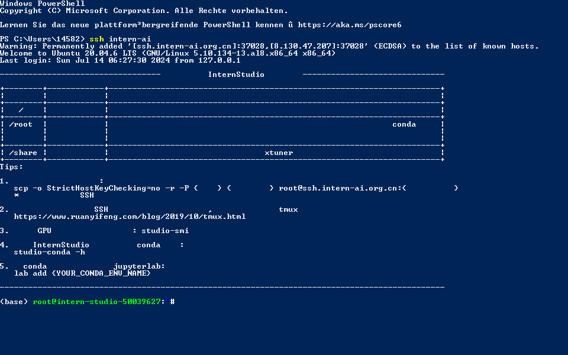

## 1.2 配置VS Code
### 1.2.1 端口映射
```sh
ssh -p 37028 root@ssh.intern-ai.org.cn -CNg -L 7860:127.0.0.1:7860 -o StrictHostKeyChecking=no
```
### 1.2.2 启动 hello world
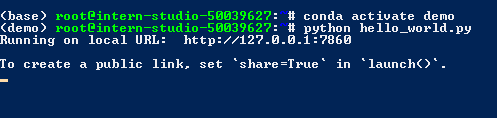


# E1 Linux基础命令
## 基础目录
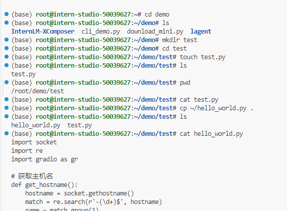
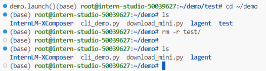
## 进程管理
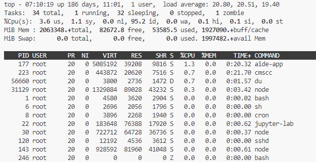
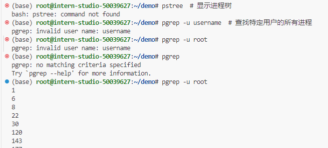
## GPU管理
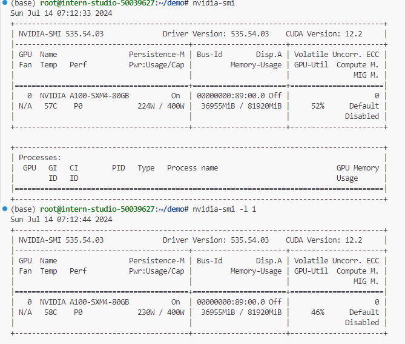
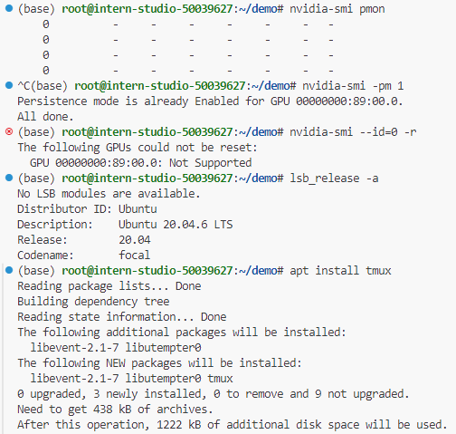

# E2 使用conda
查看现有环境  
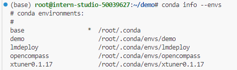

导出yml文件  
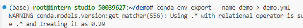

# E3 运行`test.sh`
还原虚拟环境  
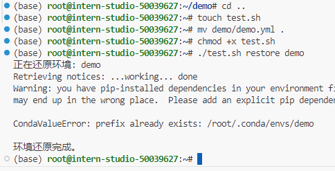

